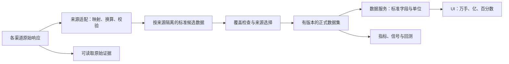

# 统一行情数据契约：来源适配、标准入库与业务输入

> 状态：2026-09-12 确定的文档基线，契约标识 `market-data/v1`。规定目标字段与数据规则，不代表数据库、接口或适配器已实现。
>
> 前提：既有 UI 展示保持不变。成交量仍显示万手，成交额仍显示亿，比例仍显示百分数；11 行 Tooltip、颜色、精度、阈值、hover、坐标轴和指标行为沿用既有显示规范。
>
> 阅读入口及实施顺序见 [文档索引](README.md)。生命周期与发布见 [存储策略](2026-08-31-kline-data-ingestion-storage-policy.md)，QMT 的调用与原始字段见 [QMT 接入规范](2026-09-12-qmt-source-adapter-spec.md)。

## 1. 职责与适用范围

本契约由系统定义，各来源必须转换到它；不能因供应商换用不同单位而修改 UI 公式。标准行情可按来源分别持久化，只有通过来源选择与完整性检查的版本才能成为正式业务输入。

- 原始层保留供应商返回字段、值、单位证据、请求参数和采集时间。“原始响应”不等于“不复权行情”；响应本身可能已经复权。
- 适配层负责代码映射、类型解析、单位换算、时间与枚举映射、能力检查。无法证明字段语义时保留原始证据并返回不可用状态，不猜测。
- 标准事实层保存本契约字段与单位；原始字段不能通过别名或扩展字段绕过校验成为正式输入。
- 数据服务负责按固定快照读取、提供同口径派生值和现有 UI 字段映射；不得再次把手转股、元转千元或把比例转百分数。
- UI 只执行既有展示换算及格式化，不识别来源，不修改源数据、不写回万手或亿值。

首期固定 A 股股票、人民币行情的字段配置。ETF 须单独登记“份到手”的换算与适用字段；指数价格可按点计，量额的覆盖范围、单位和适用性须单独登记，不能套用股票股本换手率。不同品类共用字段结构不表示全部字段必填或含义相同；缺少品类配置时不晋升对应数据集。账户、委托、新闻等使用各自契约，不塞入 K 线事实。

## 2. 字段、类型和单位

以下为标准字段的目标持久类型，不是 DDL。统一采用 `snake_case`；现有 UI 已有的 `camelCase` 名称通过固定映射提供。字段缺失与原始字段存在但为空在原始证据中区分，标准层同时给出可用性状态。

### 2.1 证券、时间和行情事实

| 标准字段 | 目标类型 | 语义、单位与约束 |
| --- | --- | --- |
| `instrument_id` | TEXT | 系统稳定证券 ID；由证券主数据映射，不能仅凭六码代码跨市场合并。 |
| `asset_class`、`exchange`、`currency` | TEXT / 受控枚举 | 品类、交易所、币种。股票本配置 `currency=CNY`；指数等按配置定义价格单位。 |
| `trade_date` | DATE | 交易日历判定的交易日期，不能直接截取未知时区的时间文本。 |
| `interval` | TEXT / 受控枚举 | 标准名称包括 `1m/3m/5m/10m/15m/30m/60m/1d/1w/1mon`；供应商名称由适配器转换。 |
| `bar_start_at`、`bar_end_at` | TIMESTAMPTZ | 经验证的实际区间边界；按 UTC 存储时间点，时段解释使用交易所时区。日线可跨多个交易时段，中间休市不能被视作缺口。 |
| `bar_label_at` | TIMESTAMPTZ | 已登记的图表时间标签；分钟标签取起点还是终点由时段契约固定，不能随来源变化。 |
| `session_contract_id` | TEXT | 固定交易日历、时段、区间端点归属、集合竞价和盘后纳入范围。 |
| `open/high/low/close` | NUMERIC(30,12) | 同根 bar、同一价格配置与复权快照的四价；股票为元/股，保留计算精度，不按 UI 两位小数入库。 |
| `volume` | NUMERIC(30,8) | **该根 bar 的成交量，股票固定为手，每手 100 股**；允许小数手，不取整。不接收 Tick 当日累计量。 |
| `amount` | NUMERIC(30,8) | **该根 bar 的实际成交额，固定人民币元**；不以 `close * volume` 生成，不按价格复权因子再次缩放。 |
| `price_basis` | TEXT / 受控枚举 | 研究/图表默认 `FRONT_ADJUSTED`；实际交易价格使用独立 `UNADJUSTED` 系列。 |
| `adjustment_method_id`、`adjustment_snapshot_id` | TEXT | 分别固定复权算法/锚定规则与该次数据的因子、事件及基准证据。仅有“前复权”字样不够。 |
| `trading_status` | TEXT / 受控枚举 | `NORMAL/SUSPENDED/RESUMED/NO_TRADE/UNKNOWN`；状态必须有覆盖目标区间的来源证据。 |
| `is_final` | BOOLEAN | 区间结束且来源完成判据通过；与 coverage 是否完整分别判断。 |

价格须有限，并满足 `high >= max(open, close, low)`、`low <= min(open, close, high)`。研究前复权价格是否允许非正值由复权方法与品类配置明确；不能用实际交易报价必须为正的规则擅自删除合法历史。作为百分比计算分母的昨收必须为正。量额须非负；正式股票有效 bar 要求 OHLC、volume、amount 齐备。已认可停牌/无成交空槽只记录状态，不伪造价格行。

### 2.2 基准、股本与派生字段

| 标准字段 | 目标类型 | 语义与规则 |
| --- | --- | --- |
| `prev_close` | NUMERIC(30,12)，可空 | 日线/分钟 UI 为该 bar 所属交易日的上一交易日同口径收盘基准；须引用对应交易日和同一复权快照。周/月等派生周期如需该字段，另在派生契约声明参考区间，不自动沿用分钟定义。 |
| `exchange_reference_price` | NUMERIC(30,12)，可空 | 市场发布的当日涨跌参考价，可能是除权参考价；与研究系列的 `prev_close` 分开，不自动互换。 |
| `float_shares` | NUMERIC(30,8)，可空 | 当日有效流通股本，单位股；保存在独立历史股本数据集，按 ID/日期引用。 |
| `change_amount` | NUMERIC(30,12)，可空 | UI/研究同口径值：`close - prev_close`。市场涨跌榜如采用交易所参考价，须登记独立计算口径，不复用不同含义的结果。 |
| `change_rate` | NUMERIC(30,16)，可空 | `(close - prev_close) / prev_close`，**小数比例**；`0.05` 表示 5%。 |
| `turnover_rate` | NUMERIC(30,16)，可空 | `volume * 100 / float_shares`，**小数比例**；使用该交易日有效的历史流通股本。 |
| `value_status` / 字段状态映射 | 受控枚举 | `VALID/MISSING/INVALID/NOT_APPLICABLE`，附原因和证据引用；真实零与缺失分开。 |

昨收不能回退结算价、同日上一分钟收盘价或缺口之前恰好有数据的收盘价。分钟跨日时逐交易日取昨收；换手率不回退总股本、不拿当前股本回填未知历史。派生字段可以由服务计算或按输入版本物化，并非要求所有派生值都写入基础 K 线表。

上游提供的涨跌幅、换手率只是候选值：先验证公式、基准、有效日期、单位和输入版本。一致时可复用，不一致则保留原始证据并按系统公式计算；必需输入不可得时返回空及原因。已验证且正确的零值不得因真假值判断被覆盖。

### 2.3 数值精度、空值与数据服务

- 适配换算和标准入库使用十进制运算。先确认上游单位，再执行已登记的精确倍率，不通过数值大小自动猜单位。
- 原始整数、浮点、字符串均由来源契约明确解析方式；布尔值、空字符串、NaN、Infinity、非法数字不能被当作有效零。二进制浮点原值仍留在证据中，转十进制不宣称能恢复上游已丢失精度。
- 原始量额/价格经单位转换后超出上述精度或范围时返回 `PRECISION_EXCEEDED`，阻止正式入库；不能依赖数据库隐式舍入或截断。需要更高精度时新建数据契约版本。
- 除法派生的比例按 16 位小数、四舍五入生成标准结果，并保留精确输入和计算版本；UI 的两位小数舍入只发生在展示阶段。若标准精度舍入使真实非零变零，或改变既有展示的符号/数值，返回 PRECISION_EXCEEDED 并保留输入，不将其伪称为真实零；需要更高精度时升级契约。
- 现有 UI 接收的行情数字继续是有限数值或 `null`，不得直接透传供应商数字字符串或因数据库 NUMERIC 序列化而改变现有 UI 输入类型。服务到 UI 的数值投影须验证有限性、精度误差和最终显示结果；研究/回测使用标准精度数据或无损十进制传输，不能取浏览器浮点值回写事实。
- 所有来源共享一组标准字段、类型和单位；不按来源另建含义不同的 `volume`。原始响应、标准候选、已发布事实应可区分，不因物理共表就混用。

## 3. 固定的 UI 输入与显示边界

| 标准字段 → 现有 UI 字段 | 服务传递单位 | 既有 UI 处理 | 展示结果示例 |
| --- | --- | --- | --- |
| `volume` → `volume` | 手 | `volume / 10000` | 45400 → `4.54万手` |
| `amount` → `amount` | 元 | `amount / 100000000` | 150000000 → `1.50亿` |
| `change_rate` → `changeRate` | 比例 | 乘 100，加 `%` | 0.05 → `+5.00%` |
| `turnover_rate` → `turnoverRate` | 比例 | 乘 100，加 `%` | 0.02 → `2.00%` |
| `prev_close` → `prevClose` | 同口径价格 | 原有价格格式化 | 10 → `10.00` |
| `change_amount` → `changeAmount` | 价格差 | 原有正负号、精度与颜色 | 0.5 → `+0.50` |
| `trade_date` / `bar_label_at` → `tradeTime` | 明确交易日 / 带时区的时间 | 上海日期 / 日期和时分 | `2026-09-04` / `2026-09-04 09:45` |

日线展示以 `trade_date` 为准，分钟展示使用映射后的 `bar_label_at`；不得把供应商未知时间直接塞给 `tradeTime`。保留现有 UI 字段名和格式化入口，不新增 UI 来源分支。

[显示规范](2026-09-06-kline-display-and-indicators-spec.md)拥有现行 UI 行为定义，[Tooltip 文档](kline-tooltip.md)保留业务说明和历史实现记录。本契约不修改显示单位、字段顺序、颜色、两位小数、小额阈值、图例、坐标轴或 hover 行为。例如既有小额正值仍按显示规范显示 `<0.01万手` / `<0.01亿`，不能通过把上游量额预先舍入到零改变 UI。

## 4. 时间、区间与复权语义

分钟 bar 的实际区间、标签、交易日和完成状态须分别验证。不同来源的起点标签与终点标签只能在区间已确认后归一；未知标签保留在原始证据中，不能用于标准事实的唯一键、分区或聚合。

`session_contract_id` 固定交易所时区（本配置 `Asia/Shanghai`）、午休、集合竞价、盘后和端点归属。历史/实时衔接按同一 bar 身份更新候选，未完成 bar 重复到达不增加指标样本；已发布终态事实修订生成新版本。日终封存还须满足存储策略的延迟、复核与完整性检查。

前复权是图表和研究的默认价格类型，`adjustment_method_id` 进一步固定算法、锚定规则、事件纳入范围以及价格/数量处理。本配置的量额代表实际区间交易量额，只做单位归一；如果来源对数量也复权，必须有独立可验证的实际量额或无损恢复规则，否则不能进入此配置，不在 UI 自动修正。

首个方法可从验收后的 QMT `front` 行为登记，但方法定义必须可独立阅读和比较，不能只写某个 SDK 参数。各来源默认是独立系列；两个来源都声称前复权，不能据此认为数值可拼接。其他算法可以登记独立方法/数据集，正式切换需完成历史、预热和下游结果重建并发布新快照。

首期接收经验证的供应商复权结果，不新增应用侧复权引擎。未来如果建设“不复权行情 + 公司行动 + 系统复权计算”，需单独定义算法、PIT、修订与迁移契约；不能在本次单位转换中顺手实施。Tick、盘口和交易证据继续使用真实未复权价格，与研究 K 线分开。

## 5. 来源身份、版本与可追溯性

以下信息可通过不可变关联记录保存，不要求每一行重复所有元数据；从任一正式值必须能解析其完整来源链。

| 标识 | 定义 |
| --- | --- |
| `data_contract_version` | 系统语义与字段类型版本，本版 `market-data/v1`；旧文档中同时包含 API 细节的契约必须显式映射迁移，不能就地改名。 |
| `source_contract_version` | 某来源接口、参数、返回形态、字段与单位映射、时间和完成证据的不可变版本；引用所实现的系统契约。 |
| `source_id` | 系统登记的具体供数服务/接入通道；唯一键使用它，QMT 的不同服务实例可以分别登记。 |
| `upstream_source_id` | 已知的真实上游；无法确认时明确 UNKNOWN 及调查证据，不把 SDK 名称当作已证实的独立上游。 |
| `adapter_id`、`adapter_version` | 采集库/适配实现及版本；更换包装库不自动产生独立数据源。 |
| `ingestion_run_id`、`received_at` | 采集批次和本系统接收时间；与行情发生时间分开。 |
| `available_at`、`effective_from/to` | 对历史股本、成员等记录当时可得时间与有效区间；未知可得时间不能支持“当时已知”的回测声明。 |
| `raw_evidence_ref`、`content_hash` | 可读取且受保留策略保护的原始响应/请求证据及校验摘要；hash 不代替原文。 |
| `source_selection_policy_id` | 按数据集选择来源、允许范围、比较容差、冲突与切换规则的不可变版本。 |
| `bar_revision`、`coverage_manifest_id`、`series_snapshot_id` | 精确事实版本、覆盖输入清单和已发布系列快照；查询/分页/指标预热固定同一快照。 |

源数据修订、映射错误修复、单位修订或股本修订须保留旧证据和旧结果，生成受影响范围的新输入及计算版本。符合相同字段结构不等于允许跨复权方法、时段或来源快照连续计算。

## 6. 多源能力、选择与故障处理

### 6.1 来源能力登记

每个来源按数据集合登记：证券品类、历史/实时、原生周期与可派生周期、最早日期、是否含退市证券、所需时段、字段单位、延迟和修订机制、PIT 元数据覆盖、权限及限流、是否有客户端缓存及刷新能力。缺分钟、缺历史股本、无停牌证据分别影响对应能力，不能把未知伪装成可用。能力未实测标为待验收，不因本契约存在就视作可替换 QMT。

### 6.2 首期支持的组合方式

1. **分数据集供数**：K 线、历史股本、板块成员、日历可以分别选不同来源，以统一证券身份、有效日期、可得时间和不可变输入清单关联。板块分类来源/体系/层级不同不能仅凭同名板块合并。
2. **同类行情并存比较**：标准候选按来源隔离；同标的、区间、时段、单位和复权方法可比后，按登记的逐字段容差比较。两份不一致数据没有多数结论，也不能默认平均价格或累加成交量。超差记录冲突并阻止相应候选正式发布，直到按策略解释/隔离或选择。
3. **完整系列切换**：替代源满足目标能力并覆盖连续计算范围及预热后，生成新 coverage/series，重算指标并原子切换。新源不满足目标方法或历史范围时，保留旧快照、来源与 `as_of`，返回 `SOURCE_UNAVAILABLE` / `COVERAGE_UNAVAILABLE` 或待修订状态，不伪装成最新。

故障选择作用域是数据集/周期/范围，不是全局“哪个接口先返回”。来源优先级只决定候选顺序，不能跳过单位、时段、质量和版本检查。展示策略可以按已配置规则返回另一来源的完整预览序列，带来源/时间/状态，UI 数值格式保持原样；不足以连续计算时不得静默缩短预热。

跨源逐 bar 补洞、逐字段拼 K 线、自动融合复权因子均不在首期实现范围。未来如启用，必须单独定义兼容证明、选择粒度、血缘和 coverage 重建，不能通过空值回退隐式开启。行情替换与券商账户/委托通道替换独立，替代行情可用不代表交易可用。

## 7. 数值基准与验收

以下为人工构造的契约样本，不代表任何实际渠道已经通过验收。A、B 表示两种输入形式；价格、区间和其他元数据假定一致。

| 编号 | 原始输入 | 标准值 | 固定 UI / 预期行为 |
| --- | --- | --- | --- |
| C01 | A：45400 手；B：4540000 股 | 两者 `volume=45400` 手 | 均显示 `4.54万手`，入库数值相同。 |
| C02 | A：150000 千元；B：150000000 元 | 两者 `amount=150000000` 元 | 均显示 `1.50亿`。 |
| C03 | 123 股 | `volume=1.23` 手 | 保留小数手；按既有小额阈值显示 `<0.01万手`，不能取整为 1 手或 0。 |
| C04 | 涨跌幅 5%，且基准/公式/快照已验证一致 | `change_rate=0.05` | `+5.00%`；不能把 5 当比例再乘 100。 |
| C05 | `volume=20000` 手；当日有效 `float_shares=100000000` 股 | `turnover_rate=0.02` | `2.00%`；总股本不能成为回退分母。 |
| C06 | `volume=0` 且当日流通股本有效；另一条 volume 缺失 | 第一条真实零；第二条 null/MISSING | 第一条换手率 `0.00%`；第二条 `--`，不能补零。 |
| C07 | Tick 累计 45400 手，缺少分钟区间量 | 不形成分钟 `volume` | 类型/语义不兼容，不能直接画成分钟柱。 |
| C08 | 来源时间可能是区间终点但尚未验证 | 只保留源时间证据 | 不生成标准时间键或 SEALED coverage。 |
| C09 | 单位不明、负量额、数字溢出或超精度 | INVALID / 具体原因 | 候选隔离，不取整、缩放猜测或静默入库。 |
| C10 | 旧源和替代源复权锚点不同 | 两个独立系列/快照 | 不直接按日期接续；重建及发布前保留旧系列状态。 |
| C11 | 新股本记录今天才可得，但对更早日期生效 | 保留有效时间和可得时间 | 当前修订研究可使用；当时已知回测按可得时间过滤。 |
| C12 | 来源更换，标准字段/值/状态完全相同 | 同样 UI 输入 | 11 行、单位、颜色、小额阈值、hover、图例和坐标轴行为均不变化。 |

静态文档验收检查字段表、公式、映射、类型、链接和引用的一致性；数值验收核算 C01～C06。实际接入还须验证 C07～C12、原始证据可读性、序列切换与指标重放，并在真实数据库和图表中确认类型/精度和 UI 表现。本次文档落盘不表示后者已完成。
