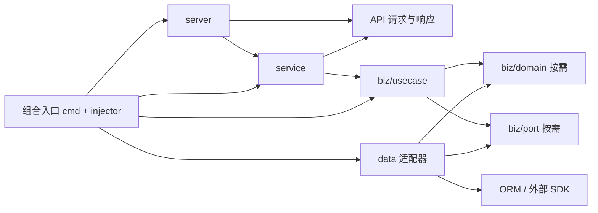

# Kratos v3 依赖方向、评审清单与当前项目复审

审查日期：2026-09-15（Asia/Shanghai）。项目基线：`a81eb7e237ed96170119be723b47e330d529b037`。本次按用户要求由三个 subagents 分别核查官方资料、业务架构、工程契约，主线程交叉验证并汇总。

> 修复状态（2026-09-15）：用户随后授权整改，K01、K02、K03 已修复并通过回归验证，三项架构澄清已同步现行文档。第 1–7 节保留初审结论、原行号与当时的验证边界；当前整改结果见第 8 节，不再将其视为未关闭缺陷。

## 1. 结论

**两份清单的核心依赖方向与当前 Kratos v3 官方模板一致；措辞存在容易误判的地方，也遗漏了工程验收项。当前项目的 Hello 业务分层正确，但不能判定“完全符合所有要求”。**

- 已确认两个当前 P2 问题：OpenAPI 与真实 HTTP 字段不一致；gRPC 部分启动失败绕过资源清理。另复现一个 P2 扩展边界问题：主动中止 RPC 被误判为未知异常并重复中止。
- 当前只有 Hello 示例，没有真实 Repository、业务表、领域实体或外部来源。持久化替换、事务、用户隔离、跨模块协作属于尚无实现可验收，不应虚构违规或勾选通过。
- 13 项现有测试、Python 编译检查、`buf lint` 通过；测试通过没有覆盖上述全部问题。
- 本次新增研究与复审记录，未修改现行清单、业务代码或生成配置；下文给出具体调整建议。

官方证据与版本辨析见 [Kratos v3 官方基线研究](2026-09-15-kratos-v3-official-baseline.md)。旧 [Scaffold 审查与整改依据](2026-09-15-scaffold-review-remediation.md) 保留历史问题，本报告不把历史发现直接当作当前缺陷。

## 2. 官方基线：区分三种方向

### 2.1 版本与适用范围

本次核实 Kratos `v3.0.0` 对应 `668db92c2c001e9552594ba5a8aede8456af6d7e`（2026-06-26），官方模板使用 `59ad406328acba9a70c9e7f426720a75a89a6b9f`（2026-09-01）固定快照。模板约定用于解释 Kratos 风格，不应被提升为所有语言实现都必须照搬的强制规范。[v3 发布](https://github.com/go-kratos/kratos/releases/tag/v3.0.0)、[模板分层约定](https://github.com/go-kratos/kratos-layout/blob/59ad406328acba9a70c9e7f426720a75a89a6b9f/AGENTS.md)。

官方资料本身也有漂移：官网 Layout 仍有 data 转换到 DTO 的表述，当前模板则明确 data 处理业务对象与持久化对象；模板 README 称内存 repo，但同一快照代码已使用 Ent。审查应结合固定源码裁决，不能把旧文案逐字当成 v3 规范。详细来源见官方基线研究 §2.1。

本仓库是 Python 对架构思想的实现：Python gRPC 提供业务，Go grpc-gateway 提供 HTTP 转码；当前 Go module 没有引入 Kratos。不能把本项目叫作已经运行原生 Kratos v3 的 Go 服务，也不应要求 Python 机械使用 Go 的 Wire、slog 或目录布局。[本地依赖](../pyproject.toml)、[gateway 依赖](../gateway/go.mod)。

### 2.2 源码依赖：决定是否违反分层



箭头表示源码引用或接口依赖。关键是 `biz` 不依赖具体 `data`；`data` 依赖业务拥有的接口。组合入口必须知道具体实现才能装配，属于允许跨层的外层，不是依赖倒置失效。[官方 biz](https://github.com/go-kratos/kratos-layout/blob/59ad406328acba9a70c9e7f426720a75a89a6b9f/internal/biz/todo.go)、[官方 Wire 装配](https://github.com/go-kratos/kratos-layout/blob/59ad406328acba9a70c9e7f426720a75a89a6b9f/cmd/server/wire_gen.go)。

### 2.3 运行时调用：可以调用到 data

```text
请求 → server → service → usecase → port 所绑定的 data 实例 → 存储 / 外部 API
```

当业务需要外部能力时，usecase 经接口调用真实 adapter，所以 data 会参与处理该请求。清单中的“不属于入站调用链”只能理解为“不是 server/service/usecase 之间的入口适配层”，不能理解为运行时不允许进入 data。调用方向与源码依赖方向不同，正是依赖倒置的意义。[官方 usecase](https://github.com/go-kratos/kratos-layout/blob/59ad406328acba9a70c9e7f426720a75a89a6b9f/internal/biz/todo.go)、[官方 repo 实现](https://github.com/go-kratos/kratos-layout/blob/59ad406328acba9a70c9e7f426720a75a89a6b9f/internal/data/todo.go)。

### 2.4 装配与生命周期

```text
组合入口 → data 资源 → repo → usecase → service → server → app
```

这是构造先后，不是业务的 import 方向。官方 `data.NewData` 内部创建共享客户端并返回 cleanup，由组合入口统一拥有其生命周期。因此，本地“injector 统一初始化和关闭”应理解为统一管理资源归属和清理，而非禁止 data 工厂封装客户端创建细节。[官方资源工厂](https://github.com/go-kratos/kratos-layout/blob/59ad406328acba9a70c9e7f426720a75a89a6b9f/internal/data/data.go)。

## 3. 两份清单的对比与建议

### 3.1 已正确、应保留的规则

- service 处理协议转换和协议侧校验，usecase 负责业务编排，data 处理基础设施。
- service/usecase 不导入具体 repo、ORM 或外部客户端实现。
- usecase 不接收 protobuf 请求、gRPC context 或 ORM model；业务模型与协议模型分离。
- 先定义契约，再实现与生成；生成物纳入版本控制。
- 构造函数注入、独立业务测试、错误映射与请求上下文传递。

这些与 [当前官方模板的边界](https://github.com/go-kratos/kratos-layout/blob/59ad406328acba9a70c9e7f426720a75a89a6b9f/AGENTS.md) 一致。

### 3.2 需要改写或限定的表述

| 当前位置 | 判断与原因 | 建议替换的含义 |
| --- | --- | --- |
| Clean §1，第 4 行：单一路径、“data 不属于入站调用链” | 混用源码依赖和运行调用，且没有画出 port 与组合入口。不是根本方向错误，但容易误读。 | 分开声明源码依赖、运行调用、装配顺序；明确 `usecase → port ← data`。domain/port 按业务需要存在。 |
| Clean §1，第 6 行：“data/adapter/infrastructure 是否仅实现 port” | 过窄。data 合理包含 ORM model、DTO 之外的数据转换、共享客户端及资源工厂。 | 限制的是不能把数据库细节泄漏到 biz，也不能承担业务决策；不限制 data 只能放接口实现类。 |
| Clean §4，第 20 行：实现与 port “一一对应” | 若按数量或文件一一对应理解，会限制一个 port 的数据库版、内存版和 fake 实现，也妨碍接口组合。 | 每个实现满足其声明的契约；允许一个 port 多个实现，不规定文件或类的数量关系。 |
| Kratos §2，第 11 行：handler/service/usecase 均通过 DTO/command | 未区分协议 DTO 与应用输入；不能据此要求每个简单参数都增加包装类。 | service 可接协议 DTO；usecase 只接业务类型、应用 command/query 或清晰基本类型，禁止接 protobuf/ORM/context。 |
| Clean §1，第 5 行：biz 无框架细节 | 作为本项目严格边界合理；并非官方模板所有依赖的逐项复刻。 | 保留 grpc/ORM/具体 SDK 禁止项，标为本项目政策。无需为了“对齐”把 Kratos errors、Wire 或 API 枚举引入 Python biz。 |
| Kratos §5，第 25 行：模块目录 | `internal/modules/<module>` 是本项目模块化约定；官方模板为平铺的 internal/biz、service、data。 | 保留本地结构，标明是 Python 项目的组织方式，不是 v3 强制目录。 |
| 两份清单：未注明版本及规则归属 | 无法区分官方建议、本地硬要求和按需能力，也容易被旧 v2 页面误导。 | 文首增加版本/commit、官方来源、本地更严格政策，以及“通过 / 不适用 / 待验证”的结果分类。 |

对应原文：[Clean 清单](agent-guides/clean-architecture-review-checklist.md)、[Kratos 清单](agent-guides/kratos-review-checklist.md)。

官方当前 biz 使用 Kratos 错误库、API error enum、AIP 查询类型，且 ProviderSet 使用 Wire。这说明官方重点在业务和存储/协议对象的边界，不能概括成“biz 零第三方依赖”。本项目选择更严格的纯 Python 业务类型没有问题。[biz 源码](https://github.com/go-kratos/kratos-layout/blob/59ad406328acba9a70c9e7f426720a75a89a6b9f/internal/biz/todo.go)、[biz ProviderSet](https://github.com/go-kratos/kratos-layout/blob/59ad406328acba9a70c9e7f426720a75a89a6b9f/internal/biz/biz.go)。

### 3.3 建议补充的验收项

1. **模型归属**：协议 DTO 属于 API/service，业务对象属于 biz，持久化对象属于 data；data 不接收协议 DTO，service 不接收 ORM model。仅在形状确实不同时增加转换类型。
2. **生命周期**：成功启动、初始化中途失败、服务绑定失败、退出和清理异常均有明确处理；组合入口拥有资源，工厂可返回资源和清理操作。
3. **契约一致性**：proto、HTTP JSON、OpenAPI、错误返回以及生成配置一起核对。仅验证生成文件没有 diff，不能发现配置稳定生成了错误契约。
4. **请求预算**：使用外部 IO 时，取消/超时跨边界传递；重试依据幂等性和总预算配置，不能要求所有适配器无条件重试。
5. **错误转换**：基础设施错误在适配边界转为业务可识别语义，协议层统一映射；已中止的 RPC 不应被当作未知业务异常重复处理。
6. **支持范围**：明确当前 unary RPC、streaming、真实持久化、身份与跨模块功能分别是否实现。未实现能力不作通过断言。
7. **本地规则例外**：snake_case 用于自定义变量/函数/字段；Python 类型名、生成 RPC 覆写方法遵守语言和生成接口约定，不能把 `SayHello` 强改成 `say_hello`。
8. **工程验收**：新增模块通过生成、导入、装配、HTTP/gRPC smoke；出现第一个持久化用例后再验证 repo fake、真实 DB、事务回滚、用户隔离和 Alembic。

这些是建议采纳的验收标准，不代表 v3 强制提供全部中间件或要求当前 Hello 实现所有扩展能力。Kratos v3 的 JSON 编码显式化、slog、JWT 移往 contrib 等是 Go 框架迁移要求；在本项目应转译为明确的序列化和依赖配置，不能机械照搬 import。[v2 → v3 官方迁移说明](https://github.com/go-kratos/kratos/blob/668db92c2c001e9552594ba5a8aede8456af6d7e/docs/migration/v2-to-v3.md)。

## 4. 当前项目已确认的问题

### K01 · P2 · OpenAPI 与实际 HTTP 响应字段冲突

- **定位**：[gen/openapi/openapi.yaml](../gen/openapi/openapi.yaml) 第 47 行；[gateway main](../gateway/cmd/grpc_gateway/main.go) 第 42 行；[buf.gen.yaml](../buf.gen.yaml) 第 26–28 行。
- **事实**：proto 定义 `request_id`，gateway 的 `UseProtoNames: true` 让实际 HTTP 返回 `request_id`；OpenAPI 声明 `requestId`。
- **触发与影响**：调用方根据 OpenAPI 生成客户端或读取字段时会得到错误字段契约。当前 [HTTP trace 测试](../tests/test_hello_transport.py) 第 133–143 行确认实际字段为 `request_id`，但没有与 OpenAPI 对比。
- **违反依据**：AGENTS §10 的跨边界 snake_case 与两份清单的契约一致性目标。这是当前实现问题，不是理论建议。
- **调整**：为 `google-gnostic-openapi` 插件增加 `opt: [naming=proto]`，再运行 `make proto` 并提交生成物；增加实际响应与 OpenAPI 字段对比的回归验证。不能手改 gen 文件。已核实本项目锁定的 v0.7.1 支持该选项且默认为 JSON 命名。[gnostic v0.7.1 官方说明](https://raw.githubusercontent.com/google/gnostic/v0.7.1/cmd/protoc-gen-openapi/README.md)。

### K02 · P2 · gRPC 部分启动失败不清理已初始化资源

- **定位**：[cmd/grpc_main.py](../cmd/grpc_main.py) 第 39–53 行初始化、创建和启动；清理作用域到第 68 行才开始。
- **事实**：`runtime.startup()` 后的 server 创建、注册、绑定、启动或信号安装失败，会绕过 `server.stop()` 与 `runtime.shutdown()`。
- **证据**：无网络 mock 中让 `server.start()` 抛异常，观察到 `runtime.startup=1`、`runtime.shutdown=0`、`server.stop=0`；绑定失败路径亦复现清理次数为零。
- **影响**：已创建资源缺少确定性释放。独立进程退出通常会被 OS 回收，但嵌入运行、启动重试或后续加入真实连接时不能依赖该行为。没有声称本次观察到数据库连接泄漏，SQLAlchemy engine 可能尚未建立连接。
- **违反依据**：AGENTS §12 的资源统一初始化与关闭；属于生命周期缺口，不是 biz 反向依赖。
- **调整**：从第一个成功取得的资源开始纳入清理作用域；仅清理已初始化的对象，并确保 server 清理异常不会跳过 runtime 清理。对应失败路径应有回归验证。

### K03 · P2，扩展边界 · 主动中止 RPC 被错误拦截器重复处理

- **定位**：[error interceptor](../internal/server/grpc/interceptors/error.py) 第 52–55 行。
- **触发**：协议 service 调用 `await context.abort(INVALID_ARGUMENT, "bad name")`。grpcio 以 `grpc.aio.AbortError` 结束调用，通用 `except Exception` 又将其作为未知异常记录，并第二次调用 abort。
- **真实本地验证**：日志出现未知异常 ERROR 和 `UsageError: Abort already called!`。**客户端仍收到 `INVALID_ARGUMENT / bad name`，没有证据表明错误码被改成 INTERNAL。**
- **影响与范围**：污染错误日志并重复执行协议控制操作；当前 Hello 不主动 abort，属于在同一适配器中已复现的扩展缺陷，不是现有 Hello 正常请求失败。
- **违反依据**：Kratos 清单 §1 的协议适配、§4 的正确日志和统一错误映射目标。
- **调整**：让已中止 RPC 的 `grpc.aio.AbortError` 控制流继续传播，保留业务错误与未知错误的统一处理；补主动 abort、业务错误和未知错误三类验证。
- **可复现证据**：临时脚本 `/private/tmp/kratos-v3-audit/verify_runtime_contracts.py`，运行 `.venv/bin/python /private/tmp/kratos-v3-audit/verify_runtime_contracts.py --local-grpc`；同时覆盖 K02 绑定失败 mock。脚本未写业务数据库或调用外部 API，结论已在本文记录，不依赖临时文件长期存在。

## 5. 当前实现符合性矩阵

| 检查项 | 结果 | 当前证据与边界 |
| --- | --- | --- |
| biz 不导入框架/具体基础设施 | 通过 | [HelloUsecase](../internal/modules/hello/biz/usecase/hello_usecase.py) 无 import，输入输出为 str；AST 覆盖 internal 19 个 Python 文件和 cmd 3 个文件。 |
| service 只做协议适配 | 通过 | [HelloService](../internal/modules/hello/service.py) 提取 name、调用用例、构造 protobuf response。 |
| 业务规则在 usecase | 通过 | 默认名称和问候文本由用例处理。没有在 gateway/data 重复业务规则。 |
| DI 与显式注入 | 正常路径通过；失败路径不完整 | [injector](../internal/conf/injector.py) 统一装配 usecase/service/engine，见 K02。 |
| 业务错误与协议错误解耦 | 结构通过；协议控制流有缺口 | [AppError](../internal/pkg/errors/errors.py) 只依赖 enum；gRPC 映射在 server interceptor。主动 abort 问题见 K03。 |
| proto、HTTP、OpenAPI 一致 | 不通过 | K01；proto 本身 lint 通过。 |
| HTTP 与直接 gRPC | 通过 | 真实进程下默认名、指定名、Unicode、并发、未知方法/路由及 trace 透传通过。 |
| 正常退出与父进程 SIGTERM | 已测路径通过 | 联调验证父进程 SIGTERM 后两处监听均释放；不等于所有部分启动失败路径通过。 |
| 请求关联标识 | unary 已测路径通过 | [TraceInterceptor](../internal/server/grpc/interceptors/trace.py) 包装实际调用，HTTP trace header 转发已验证；这不是完整分布式 tracing 验收。 |
| server 创建位置 | 组织建议 | gRPC 创建和 middleware 配置目前位于 cmd；可提取至 internal/server 工厂以保持入口薄，但没有业务规则越界，不单列硬违规。 |
| repo/source 可替换性 | 当前不适用，能力未验收 | 没有真实 repo/source/port。不能因无接口而判失败，也不能声称已实现完整依赖倒置的外部 IO 链路。 |
| ORM 查询、无外键、索引、用户隔离 | 当前无业务实现可验收 | models.py 仅导入共用 Base，没有业务表/查询/关联数据。 |
| Alembic 与事务 | 框架存在，真实链路未验收 | 迁移失败阻止启动的现有测试通过；无业务 migration/repo，未访问 PostgreSQL。 |
| 生成可重建性 | 配置和 CI 静态检查通过；本轮未重建 | make/Buf 锁定与 CI 空目录生成检查存在，本轮未调用远程生成器，不以历史记录代替当次验证。 |
| 第二模块完整开发链路 | 部分验证 | 当前生成器测试验证文件名与模板文本，没有实测新增模块生成、注册、HTTP/gRPC 全链路。 |
| 流式 RPC | 不在当前已验收范围 | 两个 interceptor 对 streaming 直接透传；当前 proto 仅 unary，不算 Hello 故障。 |

## 6. 本次执行的验证

| 验证 | 结果 |
| --- | --- |
| `uv run --frozen python -m unittest discover -s tests -p 'test_*.py' -v` | 13 项通过，2.586 秒；包含真实 HTTP → gateway → Python gRPC 与 SIGTERM 清理。 |
| `uv run --frozen python -m compileall -q internal tests cmd` | 通过；缓存写入临时目录。 |
| `buf lint` | 通过。 |
| 全量源码及 AST 分层检查 | 未发现 biz 导入协议/存储框架或具体 data。 |
| OpenAPI / proto / gateway / HTTP 测试交叉检查 | K01 确认。 |
| gRPC 启动失败 mock 探针 | K02 确认。 |
| 真实临时 gRPC 服务主动 abort | K03 确认：客户端状态保留，但服务端误记 ERROR 并重复 abort。 |

首次在默认沙箱运行联调时，`socket.bind` 被环境拒绝；随后获得执行权限后完整测试通过。首次失败是环境限制，不计为项目缺陷。测试显式清空 DSN、禁用自动迁移，未连接业务数据库。

## 7. 调整优先级

1. 修复 K01、K02，并处理 K03 的协议控制异常；补充各缺口的回归验证。
2. 按第 3 节澄清两份清单，并同步 ARCH_LAYERS 与 AGENTS 的相关表述；保留本项目更严格的业务隔离政策。
3. 为第一个真实持久化业务补齐 port → repo → ORM、事务及用户隔离验收，再判断这些能力是否通过；不要为 Hello 添加空壳领域对象或空接口。
4. 按实际产品范围决定超时、取消、流式 RPC 和跨模块验收，不能从“Kratos 风格”自动推导出所有生产能力必须在 Hello 中实现。

**最终判定：核心架构方向合格；两份清单需要澄清和补项；当前项目仍有确定缺陷和未实现能力，不能声明完全符合全部要求。**

## 8. 授权整改与复验（2026-09-15）

### 8.1 已完成修复

| 问题 | 修复 | 回归证据 |
| --- | --- | --- |
| K01 | [buf.gen.yaml](../buf.gen.yaml) 为 gnostic 插件设置 `naming=proto`，执行 `make proto`；生成的 OpenAPI 现在声明 `request_id`。 | [test_hello_transport.py](../tests/test_hello_transport.py) 按响应 `$ref` 读取 OpenAPI schema，同时比较 protobuf 字段和真实 HTTP 响应字段。修改前该项明确失败于 `requestId`/`request_id`，修改后通过。 |
| K02 | [grpc_main.py](../cmd/grpc_main.py) 将整个启动过程纳入清理范围；server 关闭异常也继续关闭 runtime。[injector.py](../internal/conf/injector.py) 的 `startup()` 改为 async，装配中途失败时先释放已创建 engine 再抛出异常；唯一生产调用方已同步 `await`。 | [test_application_startup.py](../tests/test_application_startup.py) 新增 7 个失败路径测试，覆盖服务创建、注册、绑定、启动、信号安装、server 关闭异常及 runtime 部分装配失败。原代码 7 项均失败，修复后通过。 |
| K03 | [error.py](../internal/server/grpc/interceptors/error.py) 重新抛出 `grpc.aio.AbortError`，不将已终止的 RPC 归为未知异常，也不二次 abort。 | [test_error_interceptor.py](../tests/test_error_interceptor.py) 在真实临时 aio gRPC 服务上验证成功响应、主动 abort 无 ERROR 日志、5 类业务错误映射及未知异常脱敏。修改前 4 项中主动 abort 一项失败，修改后全部通过。 |

为了可靠读取 OpenAPI YAML，增加 PyYAML 6.0.3 作为开发依赖并更新 `uv.lock`；生产依赖未增加。测试由默认 `uv sync --frozen` 开发环境和现有 CI 安装。

### 8.2 三项架构结论已同步现行文档

同步范围：[AGENTS.md](../AGENTS.md)、[ARCH_LAYERS.md](ARCH_LAYERS.md)、[Clean 清单](agent-guides/clean-architecture-review-checklist.md)、[Kratos 清单](agent-guides/kratos-review-checklist.md)、[PROJECT_USAGE.md](PROJECT_USAGE.md)。

1. 分别描述源码依赖、运行时调用和依赖注入顺序。组合入口由 `cmd` 与 injector 共同构成：injector 装配业务并管理基础资源，cmd 创建/启停 server 并协调清理。
2. 保留 Python biz 禁止依赖框架、协议 DTO、ORM/session 和具体 data 实现的规则，并明确它是本项目更严格的政策。
3. 明确 data 可以包含 PO、client、mapper 和资源工厂；port 可有多个实现；简单用例按需建立 domain/port/应用 DTO；工厂封装初始化细节，组合入口统一拥有资源生命周期。

清单同时补充 HTTP/OpenAPI 一致性、异常生命周期和按能力判定“通过 / 不适用 / 待验证”的规则。现行文档采用这些澄清；第 3 节和官方研究中引用的原条目仅保留为修订依据。

### 8.3 本轮验证结果与限制

- `uv run --frozen python -m unittest discover -s tests -p 'test_*.py' -v`：**25 项通过，1.233 秒**，包含真实 HTTP/gRPC、并发、trace、错误拦截器和父进程 SIGTERM。grpcio 在同一测试进程先启动线程再创建子进程时输出了 fork handler 提示，未导致测试失败。
- `uv run --frozen python -m compileall -q internal tests cmd`、`buf lint`、`git diff --check`：通过。
- 工作区执行 `make proto`：通过；生成物变化只有 OpenAPI 的 `requestId → request_id`。
- 在临时目录仅复制生成输入、Makefile 和 gateway 锁文件，从不存在 `gen` 的状态执行 `make proto`：**生成 15 个文件，与工作区逐字节比较零差异**，排除 Python 运行缓存。首次临时生成因沙箱无法连接 Buf 失败，经执行权限升级后验证通过。
- 独立 subagent 只读复审：未发现新增阻断项，确认 async startup 调用方完整、错误映射未被放宽、开发依赖与 CI 相容。
- 未连接真实 PostgreSQL；真实持久化、事务、用户隔离和流式 RPC 仍保持原有能力边界，不能因本次修复而标记验收通过。

**当前判定：本次确认的 K01–K03 已关闭，三项文档澄清已落实。已实现 Hello 骨架的相关回归通过；尚无实现的业务能力继续按不适用或待验收管理。**
