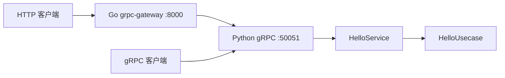

# Python / gRPC-Gateway Scaffold 审查与整改依据

审查日期：2026-09-14；文档落盘与补充验证：2026-09-15（Asia/Shanghai）。

用途：完整保存本次暂存区审查，作为后续整改、回归验证与复审依据。本文保留原始发现，不用后续升级结果覆盖历史证据；当前进展单独列出。本文中的整改项是待实施与验收的工作依据，本次交付仅包含文档和验证，没有执行这些代码整改。

## 1. 结论、范围与版本边界

原审查结论：**暂不建议直接作为可复用 scaffold 合入。** HTTP 与原生 gRPC 的 Hello 通信能够运行，但数据库迁移、进程生命周期、模块扩展、生成契约与文档指引存在缺陷。目录具备分层外形，尚不能证明完整的依赖反转、持久化、事务和用户隔离能力。

原审查范围是当时整个暂存区的 **66 个新增文件、2,590 行**，包括代码、协议、生成物、依赖锁、配置、脚本及 7 份 Markdown。原 HEAD 为 `2bac950a57547a06cc64bee5084c6907085c44e6`，当时工作区与暂存区一致。完整文件清单见附录 A。

用户要求至少覆盖：

1. 代码规范、组织和约束与 go-kratos 3.0 思想的一致性，以及如何进行 Python 化。
2. Python 微服务、gRPC、Go grpc-gateway、HTTP、生成和启动停止的完整链路。
3. 暂存文档的正确性、合理性、必要性和重复内容。

执行方式：主线程汇总并交叉验证，三个子智能体分别审查架构与 Python、gateway 与协议可靠性、文档与开发脚本。审查以只读方式执行；复现使用临时文件、临时数据库和独立本地端口。未修改原暂存内容，未访问业务数据库。

### 1.1 后续变化与本文状态的含义

2026-09-15 文档落盘前，仓库已出现独立的依赖升级工作：当前 HEAD 为 `c61422d33bc486dd9e3b7ee61d49b484b234a9c9`，提交说明为 `chore(deps): pin upgraded dependencies and generated protocol artifacts`。当前暂存区变为 45 个文件，工作区另有未暂存修改和未跟踪的联调测试。相关记录见 [依赖升级验收](2026-09-15-dependency-upgrade-results.md) 与 [升级评估](2026-09-14-dependency-upgrade-assessment.md)。

因此，**本文的原发现不等于对当前工作区逐项重新判定失败**。正文中的代码行号指原审查基线；链接指向当前文件，行号变化时以函数或语句定位。第 7 节记录当前可确认的整改进展及其证据层级。

状态约定：

- **已复现**：原审查版本已通过针对性实验确认问题。
- **静态确认**：代码、配置或契约足以确定问题与触发条件，未声称在全部目标环境执行过。
- **扩展触发**：当前 Hello 不触发，但按 scaffold 的扩模块方式可以复现。
- **建议 / 决策项**：影响架构或维护，不等同于已有请求故障。
- **待复验**：看到了修改或其他任务的验证记录，尚不足以关闭对应验收项。

## 2. Kratos 3.0、Python 化与实际架构

### 2.1 官方基线与合理选择

原审查已核对 [Kratos v3.0.0 发布](https://github.com/go-kratos/kratos/releases/tag/v3.0.0) 和 [v2 → v3 迁移说明](https://github.com/go-kratos/kratos/blob/main/docs/migration/v2-to-v3.md)。v3 强调减少核心耦合、显式依赖与配置、标准库日志，并明确协议编码和生成流程。评审不能把旧 v2 网页中的默认行为直接当作 v3 要求。

以下现有选择合理，应保留其目的：

- Protobuf 契约先行，Python 承载业务，Go 负责 HTTP/JSON 转码。
- `HelloUsecase` 使用纯 Python 字符串，不依赖 gRPC、SQLAlchemy 或具体 repo。
- `HelloService` 继承生成 Servicer、接收 protobuf 请求、调用 usecase 并转换响应，符合 [官方 layout](https://github.com/go-kratos/kratos-layout) 的协议适配职责。service 导入 protobuf 本身不是跨层违规。
- 显式构造函数注入与 `AppRuntime` 集中装配足以体现 Wire 的依赖装配思想，无需额外引入运行时 DI 框架。
- Python `logging`、`ContextVar`、`asyncio` 是合理的语言原生实现。无需照搬 Go 的 `slog` API。
- engine 与 session factory 集中管理、关闭时 dispose 的方向正确；这不等于已验证实际事务、连接恢复或多模块模型注册。

目标职责应统一为：

| 部分 | 职责与允许的依赖 |
| --- | --- |
| `cmd` / composition root | 读取配置、装配对象、协调启动和停止。 |
| `internal/server` | 创建服务、配置中间件、注册协议服务。 |
| `modules/<module>/service.py` | 协议输入输出转换、协议侧校验与上下文适配，调用 usecase。 |
| `biz/usecase` | 业务编排与规则，通过 port 使用外部能力。 |
| `biz/domain` | 业务对象、业务规则与框架无关的错误语义。 |
| `biz/port` | 外部能力契约，可采用适当的 Python `Protocol` 或 ABC。 |
| `data` | 实现 port，处理 ORM、外部 API 与其他基础设施。 |
| Go gateway | HTTP/JSON 与 gRPC 的协议转换、必要的 header / deadline / 错误边界。 |

入站调用方向是 `server → service → usecase → domain`；数据适配器是 `data → biz/port` 的实现依赖。不能把所有基础设施画成 `infrastructure → server` 的单一路径。

### 2.2 当前真实链路及能力边界



该链路符合 [grpc-gateway 的 HTTP/JSON 到 gRPC 转码模式](https://github.com/grpc-ecosystem/grpc-gateway)。原生 gRPC 客户端直接连接 Python。当前 Go 程序只有 `net/http.Server` 与 `runtime.ServeMux`，没有 Kratos 依赖、原生 gRPC listener、HTTP/2 分流或透明 gRPC 代理。

如果产品要求 **HTTP 和原生 gRPC 都经同一个网关入口分发**，这项能力尚未实现，需要另行确定入口协议与部署方案。原审查没有把该意图自动扩展为实现授权。

## 3. 需要整改的代码与契约问题

严重级别：P1 为高影响故障或破坏性契约问题；P2 为有明确触发条件的功能、扩展或维护缺陷；P3 用于文档与工程组织建议。所有验收勾选初始为空；看到代码修改或文档写明“通过”不等于本项全部关闭。

### R01 · P1 · 迁移失败后自动标记完成，并继续启动

- **定位**：[cmd/main.py](../cmd/main.py)，原 51–75 行，`_run_local_auto_migration()`。
- **触发**：默认 `APP_ENV=local` 且设置数据库 DSN，迁移报 `DuplicateTableError` 或任意包含 `already exists` 的 stderr；普通迁移错误也触发失败后继续流程。
- **问题**：代码执行 `stamp head` 把当前数据库标为迁移完成，却没有保证 schema 等于目标。其他错误只打印日志，函数正常返回，随后服务继续启动。`APP_ENV` 未设置时也默认进入 local 路径。
- **证据**：临时 SQLite 中预先用 SQLAlchemy 创建 `existing_item`；测试迁移依次创建同名表和 `required_item`。运行项目迁移函数后，实际表仅有 `existing_item` 和 `alembic_version`，版本记录为 `001`，`required_item` 不存在，函数仍正常返回。另用 subprocess 返回值实验验证普通失败也正常返回。没有对真实 PostgreSQL 执行迁移。
- **整改**：删除自动 stamp 恢复；迁移失败使启动明确失败。已有数据库结构的接管应是独立操作，经过结构核对后才允许设置迁移版本。[Alembic 明确说明 stamp 不运行迁移](https://alembic.sqlalchemy.org/en/latest/api/commands.html#alembic.command.stamp)。
- **验收**：
  - [ ] 重复对象或其他迁移错误均导致启动失败，且不会启动任何子服务。
  - [ ] 错误后版本表不被冒进更新；缺失表仍能通过后续正确迁移恢复。
  - [ ] 自动迁移的启用范围和运维入口在使用指南中明确。

### R02 · P1 · 固定 Homebrew Go 路径导致 Linux 与 CI 无法运行

- **定位**：[Makefile](../Makefile) 原 3、13 行；[cmd/main.py](../cmd/main.py) 原 104 行；[run_gateway.sh](../scripts/run_gateway.sh) 原 10 行；[CI](../.github/workflows/proto-sync.yml) 原 10、24–26 行。
- **问题**：固定 `/opt/homebrew/bin/go`，但 Ubuntu CI 的 `setup-go` 将工具安装在 PATH 可发现位置。即使远程生成成功，Makefile 后续也会调用不存在的路径。原 Makefile 还固定 `/bin/zsh`。
- **证据**：配置静态确认。原 Linux CI 没有实际运行；本机恰有该 Homebrew 路径，不能用本机成功证明跨平台正常。
- **整改**：统一使用可覆盖的 `GO ?= go`、适当的 PATH 查找和可移植 shell。Go 版本由模块与 CI 统一约束。
- **补充校准**：原 CI 配置 Go 1.24，模块要求 1.25；默认自动工具链可能下载新版，因此不能将版本不同单独断言为必然失败。固定不存在的路径才是确定故障。
- **验收**：
  - [ ] 不依赖 Homebrew 路径，常规 macOS/Linux 安装均能生成、构建与启动。
  - [ ] Ubuntu CI 执行生成、gateway 构建和协议 smoke 验证。

### R03 · P1 · 父进程退出后子服务继续监听

- **定位**：[cmd/main.py](../cmd/main.py)，原 103–118、124–138 行；[gateway main](../gateway/cmd/grpc_gateway/main.go)，服务生命周期。
- **问题**：主进程没有 SIGTERM 清理处理；Popen 管理的是 `go run`，其编译后的网关子进程不会可靠跟随 `terminate()` 退出；等待 gRPC ready、启动 gateway 位于 `try/finally` 外，失败时也可能留下 Python 服务。
- **证据**：独立端口 56072/58072 实测，仅向父进程发 SIGTERM，父进程返回 -15，两个端口仍监听；仅发 SIGINT，父进程返回 -2，Python 端口停止但 gateway 仍监听。实验最终清理全部子进程并确认端口释放。
- **影响**：重启端口冲突、旧进程继续承接请求、IDE 停止或进程管理器终止后状态失真。
- **整改**：直接管理已构建的 gateway 二进制；集中处理 SIGINT/SIGTERM；完整启动过程纳入清理作用域；gateway 调用 `http.Server.Shutdown`。资源清理必须覆盖启动失败和重复停止。
- **验收**：
  - [ ] 只给父进程 SIGTERM 或 SIGINT，两条监听均关闭且无孤儿进程。
  - [ ] gRPC ready 超时、gateway 启动异常等部分失败清理已启动资源。
  - [ ] 有进行中的 HTTP/gRPC 请求时终止父进程，停止接收新请求；现有请求按声明宽限期完成或明确取消，超时后所有资源释放。
  - [ ] 测试验证应用自身清理，而非只依赖测试框架杀整个进程组兜底。

### R04 · P2 · 模块生成器修改导入但不重命名文件

- **定位**：[new_module_from_scaffold.sh](../scripts/new_module_from_scaffold.sh)，原 54–58、69–77 行。
- **触发 / 问题**：创建 `sample_module` 后，service 导入 `biz.usecase.sample_module_usecase`，实际文件仍是 `hello_usecase.py`。生成测试反而继续导入旧文件名，且只断言实例存在。
- **证据**：临时副本中仅先处理 R05 的 Bash 兼容阻碍，再运行原生成逻辑；新导入路径报 `ModuleNotFoundError`，生成单测却通过。
- **整改**：同步替换文件名和内容，统一测试导入，验证 service 与 composition root 可以装配；接线步骤参见 R15。
- **验收**：
  - [ ] `sample_module` / `user_manager` 等有效名称生成后，导入路径全部存在。
  - [ ] 生成服务可接入 gRPC 和 HTTP；生成测试能发现错误导入，而非仅验证对象非空。

### R05 · P2 · 模块生成器不兼容 macOS 默认 Bash

- **定位**：[new_module_from_scaffold.sh](../scripts/new_module_from_scaffold.sh)，原 43 行 `${part^}`。
- **证据**：原脚本使用 `#!/usr/bin/env bash`，本机 Bash 3.2.57 运行时退出码 1，报 `bad substitution`。该语法需要 Bash 4+，脚本和先决条件没有说明或检查。
- **整改**：使用兼容的大小写转换，或声明并检查 Bash 版本；不要让创建过程进行一半后才失败。
- **验收**：
  - [ ] 支持的 shell 上原样执行成功；不支持的环境在写文件前给出明确提示。

### R06 · P2 · Python 生成包存在两种导入命名空间

- **定位**：[service.py](../internal/modules/hello/service.py) 原 2 行；[hello_pb2_grpc.py](../gen/python/hello/v1/hello_pb2_grpc.py) 原 5 行；两份 bootstrap 与 gRPC 入口。
- **问题**：业务按 `gen.python.hello.v1` 导入，生成代码内部按 `hello.v1` 导入。仅在入口插入 `gen/python` 到 `sys.path` 后工作，service 与 injector 无法独立导入。
- **证据**：原锁定环境从仓库根目录执行 `from internal.modules.hello.service import HelloService`，报 `ModuleNotFoundError: No module named 'hello'`。原有两个 usecase 测试没有触及 service，因而掩盖问题。
- **整改**：确定唯一规范包名，用可安装包或统一包配置提供；通过生成与包装配置解决，保持生成物可重建。两份重复 bootstrap 的取舍见 A07。
- **验收**：
  - [ ] 从标准测试入口可直接导入 service / injector，且无需测试专用路径补丁。
  - [ ] 启动入口、独立客户端与测试采用一致的包加载方式。
  - [ ] descriptor 一致性通过仅是一项检查，不能替代独立导入验证。

### R07 · P2 · go_package 与真实生成模块路径不一致

- **定位**：[hello.proto](../api/proto/hello/v1/hello.proto)，原 7 行；[生成模块](../gen/go/go.mod)。
- **问题**：`go_package` 声明 `github.com/aloha66/quant-service/api/hello/v1;v1`，实际模块为 `github.com/aloha66/quant-service/gen/go`。`paths=source_relative` 决定输出位置，不会改写其他 proto 引用时的 Go import。
- **证据**：在临时 proto 中定义 `WrappedHello { hello.v1.SayHelloResponse response = 1; }`，使用本地 protoc 与 Go 插件生成，出现 `github.com/aloha66/quant-service/api/hello/v1` import。该路径没有对应的生成 Go 包。当前单文件示例没有触发跨文件导入。
- **整改**：修正 go_package 或统一 Buf managed 的包前缀。[Go Protobuf 包规则](https://protobuf.dev/reference/go/go-generated/#packages)。
- **验收**：
  - [ ] 第二个 proto 引用 Hello 消息后，生成模块与 gateway 均可构建。
  - [ ] 模板创建的新模块采用相同包路径约定。

### R08 · 原 P2，补充复现后为历史 P1 · 生成器未固定，生成代码与运行库失配

- **定位**：[buf.gen.yaml](../buf.gen.yaml) 原 3–22 行；[pyproject.toml](../pyproject.toml) 原 protobuf 精确版本；原 [Makefile](../Makefile) 与 `clean-proto`。
- **原发现**：所有远程插件省略版本，Buf 每次选最新插件；`buf.lock` 锁 schema 依赖，不锁插件。删除 `gen/go` 会同时丢弃 `go.mod/go.sum`，后续无约束 `mod tidy` 也不能保证恢复原依赖。[Buf 版本固定说明](https://buf.build/docs/configuration/v2/buf-gen-yaml/#type-of-plugin)。
- **2026-09-15 新证据**：用户授权远程生成后，原 66 文件快照执行 `make proto` 返回 0。随后在原锁定环境导入生成包，出现：

  ```text
  google.protobuf.runtime_version.VersionError:
  Detected incompatible Protobuf Gencode/Runtime versions when loading
  hello/v1/hello.proto: gencode 7.36.1 runtime 7.34.1.
  Runtime version cannot be older than the linked gencode version.
  ```

  原配置已能实际生成无法被其锁定运行库加载的代码，故将历史问题从可能漂移的 P2 提升为已复现启动阻断的 P1。该判断针对原快照；当前固定版本的整改结果见第 7、8 节。
- **整改**：固定全部插件版本及 revision，联合升级 Python/Go runtime；在生成目录之外保存稳定依赖来源，使空目录重建和保留目录生成均可重复。遵守 [Protobuf 跨版本保证](https://protobuf.dev/support/cross-version-runtime-guarantee/)。
- **验收**：
  - [ ] 原样再生成无意外差异。
  - [ ] 删除生成目录后重建，文件集合和内容与声明基线一致。
  - [ ] 重建后生成包在锁定 Python 环境导入成功，gateway 使用锁定 Go 依赖构建成功。
  - [ ] 插件、schema、运行库与工具链的升级有统一验证入口。

### R09 · P2 · Proto Sync 漏检新增未跟踪生成物

- **定位**：[proto-sync.yml](../.github/workflows/proto-sync.yml)，原 36–37 行。
- **问题**：`git diff --exit-code -- gen/python gen/openapi gen/go` 只检查已跟踪文件。新增 proto 的新生成文件忘记提交时，如果既有输出没变化，检查仍可能成功。
- **证据**：临时 Git 仓库中创建未跟踪 `gen/python/new_pb2.py`，上述命令返回 0，而 `git status --porcelain` 显示 `?? gen/`。
- **整改**：包含未跟踪文件检查；同时明确删除 proto 后旧生成物的清理策略。
- **验收**：
  - [ ] 故意遗漏新增生成文件时 CI 失败；全部提交后成功。
  - [ ] 删除 proto 后，不残留旧生成服务或旧 schema。

### R10 · P2 · trace 完成日志在业务执行前写出

- **定位**：[trace.py](../internal/server/grpc/interceptors/trace.py)，原 41–46 行。
- **问题**：`continuation()` 返回的是 handler 查找结果，不执行 RPC；此处 finally 记录的仅是查找与装配时间，无法反映业务完成、错误或取消。[gRPC asyncio interceptor 定义](https://grpc.github.io/grpc/python/grpc_asyncio.html#grpc.aio.ServerInterceptor.intercept_service)。
- **证据**：返回 handler 时 `rpc_executed=False`，日志已有 Started/Completed，耗时约 1.06ms；随后实际调用 handler 耗时约 201.18ms，未新增完成日志。
- **整改**：包装 handler 实际执行范围，用 `time.perf_counter()` 测时，在 finally 中记录耗时与最终状态。
- **验收**：
  - [ ] 慢请求日志耗时包含业务时间，Completed 出现在真正执行结束之后。
  - [ ] 成功、异常和取消路径均正确记录，不误报成功。

### R11 · P2 · HTTP X-Trace-Id 未转发至 Python

- **定位**：[gateway main](../gateway/cmd/grpc_gateway/main.go)，原 28 行 `runtime.NewServeMux()`；Python trace interceptor。
- **问题 / 证据**：真实 HTTP 请求携带 `X-Trace-Id: http-known-trace` 后，Python 日志产生新 UUID。原生 gRPC 的 `x-trace-id` metadata 和 HTTP `Grpc-Metadata-X-Trace-Id` 能保留值；默认 matcher 不接受普通 `X-Trace-Id`。
- **整改**：配置只放行所需追踪头的 `WithIncomingHeaderMatcher`，其余保留 `DefaultHeaderMatcher`。明确生成、透传和必要的响应回传规则，避免把任意客户端 header 无差别信任为身份。[官方 header 映射配置](https://grpc-ecosystem.github.io/grpc-gateway/docs/mapping/customizing_your_gateway/#mapping-from-http-request-headers-to-grpc-client-metadata)。
- **验收**：
  - [ ] HTTP 与原生 gRPC 的约定 trace ID 均出现在对应请求日志中。
  - [ ] 并发请求上下文隔离；缺省 ID 的生成行为可预测。

### R12 · P2 · 默认 JSON 输出不符合 snake_case 契约

- **定位**：[gateway main](../gateway/cmd/grpc_gateway/main.go)，原 28 行；[AGENTS.md](../AGENTS.md) 原 62 行。
- **问题 / 证据**：默认 JSONPb 输出 camelCase。对同一默认 mux 序列化含 `request_id` / `serving_data` 的消息，实际输出 `requestId` / `servingData`。现有 `name` / `message` 字段没有下划线，无法揭示问题。
- **整改**：设置 `protojson.MarshalOptions{UseProtoNames: true}`，并保证 OpenAPI 的字段命名与实际协议相同。[官方 Proto 字段名配置](https://grpc-ecosystem.github.io/grpc-gateway/docs/mapping/customizing_your_gateway/#using-proto-names-in-json)。
- **验收**：
  - [ ] 含 `user_id` 等复合字段的 HTTP 响应使用 snake_case。
  - [ ] Proto、HTTP JSON、OpenAPI 的字段约定一致，并明确请求兼容策略。

### R13 · P2 · Alembic 只加载 Hello metadata

- **定位**：[alembic/env.py](../alembic/env.py)，原 10–16 行；[模块 Base](../internal/modules/hello/data/repo/models.py)。
- **触发**：按脚手架复制新模块并定义 ORM 模型；每个模块获得独立 DeclarativeBase。
- **问题 / 证据**：Alembic 仅使用 `hello.Base.metadata`。临时内存 SQLite 中，独立 UserBase 的模型在空库 compare 时得到空差异；该表已存在时，compare 产生 `remove_index` 和 `remove_table`。当前 Hello 无实体表，这是已验证的扩展缺陷，非声称现有业务表已被删除。
- **整改**：共享 Base 并集中导入全部 ORM 模型，或显式维护 metadata 集合；新增模块流程同步模型注册。[Alembic 多 metadata 说明](https://alembic.sqlalchemy.org/en/latest/autogenerate.html#autogenerating-multiple-metadata-collections)。
- **验收**：
  - [ ] 两个业务模块的模型均进入 autogenerate。
  - [ ] 已登记模块的既有表不会被误识别为待删除。

### R14 · P2 · 文档迁移命令不读取要求设置的 DSN

- **定位**：[启动指南](PROJECT_STARTUP_GUIDE.md)，原 19–22 行；[alembic/env.py](../alembic/env.py) 原 19–26 行；[alembic.ini](../alembic.ini)。
- **问题 / 证据**：指南先要求设置 `POSTGRES_DSN`，再执行 `uv run alembic upgrade head`，但 env.py 只读取 `-x dsn` 或 ini，后者默认空。锁定环境设置 DSN 后执行原命令，仍在访问数据库前报 `Database DSN is required`。
- **整改**：文档使用 `uv run alembic -x dsn="$POSTGRES_DSN" upgrade head`，或让 Alembic 统一读取项目配置；只选择一种权威配置读取方式并同步说明。
- **验收**：
  - [ ] 按指南逐条执行，可解析预期 DSN 并进入正确迁移流程。
  - [ ] 缺少 DSN 时给出明确错误；无数据库 Hello 启动不触发迁移。

### R15 · P2 · 新增模块流程遗漏 Go gateway 注册

- **定位**：[使用指南](PROJECT_USAGE.md)，原 31–35 行；[模块脚本](../scripts/new_module_from_scaffold.sh) 原 89–91 行；[gateway main](../gateway/cmd/grpc_gateway/main.go) 原 34 行。
- **问题**：步骤只涵盖 proto、业务实现和 Python injector / servicer 注册。Go 程序仅显式注册 Hello；`make proto` 不会自动追加新服务的 `Register...HandlerFromEndpoint`。
- **影响 / 证据**：代码静态确认。完成所写 Python 接线不等于完成 HTTP 路由；新服务未在 gateway 注册时对应 HTTP 请求返回 404。
- **整改**：补充 Go gateway 注册、Python 入口向注册器传入服务、模型注册（如适用）以及双协议 smoke。
- **验收**：
  - [ ] 另一位开发者按文档或脚本输出完成新模块后，原生 gRPC 与 HTTP 均可访问。

### R16 · P2 · 数据库默认值与“数据库可选”语义冲突

- **定位**：[start_project.sh](../scripts/start_project.sh) 原 11–13 行；[docker-compose.yml](../docker-compose.yml) 原 9、15 行；[AGENTS.md](../AGENTS.md) 原 52 行；[PyCharm 指南](PYCHARM_DEBUG.md) 原 15 行；[MCP 配置](../.vscode/mcp.json)。
- **问题**：脚本和部分示例连接 `/scaffold`，Compose 创建、健康检查和 MCP 使用 `/quant`。原 `${POSTGRES_DSN:-...}` 还会把显式空字符串替换为数据库 DSN，导致可选数据库路径变成自动迁移路径。
- **证据**：临时脚本副本使用只打印环境的假 uv，输入 `POSTGRES_DSN=''`，仍输出 `/scaffold`。数据库名称差异由配置确认，没有启动真实数据库。
- **整改**：统一数据库名称与默认值来源，保留空 DSN 的无数据库路径。数据库启动作为清晰的可选步骤。
- **验收**：
  - [ ] 保持自动迁移默认启用，DSN 未设置和显式空字符串两种情况下均可启动 Hello，且不调用迁移、不创建数据库资源；有数据库路径按提供的 Compose 与示例连接同一数据库。
  - [ ] 脚本、IDE、MCP 示例和文档不再维护互相冲突的 DSN。

### R17 · P2 架构契约 · 业务错误直接绑定 gRPC

- **定位**：[errors.py](../internal/pkg/errors/errors.py)，原 1–12 行及派生异常；[error interceptor](../internal/server/grpc/interceptors/error.py)。
- **问题**：自称业务层异常的 AppError 导入 grpc，并以 `grpc.StatusCode` 为字段类型和默认值。业务 usecase 一旦使用这些异常，就间接依赖传输框架，与 biz 不依赖框架的约束冲突。
- **校准**：当前 HelloUsecase 未使用这些异常，此项是需要调整的 scaffold 契约，不是当前 Hello 请求失败。原子智能体将其列为 P2，原汇总答复放在架构建议；本文保留其完整依据。
- **整改**：纯 Python 业务错误类别 / 稳定 reason / metadata；在 gRPC interceptor 映射状态码。现有 `meta` 未被拦截器输出，保留时应明确传输语义。
- **验收**：
  - [ ] usecase 与业务错误契约的整个依赖链均不依赖 gRPC，可在未安装 grpcio 的业务测试环境中导入并执行业务与错误路径；协议测试验证对应错误映射。
  - [ ] 预期错误保留必要业务语义，未知错误不向客户端泄露内部细节。

## 4. 文档与工程组织建议

本节保留原审查对必要性的判断。文档合并、删除和架构扩展均是后续整改选择，本次没有执行。

### 4.1 七份暂存文档的取舍

| 文档 | 建议 | 必须保留或修正的内容 |
| --- | --- | --- |
| [AGENTS.md](../AGENTS.md) | 保留并缩短 | 保留可执行约束、命令与权威文档入口。`admin` 占位、无外键、ORM-only 是本项目策略，应与 Kratos/Python 通用原则区分。 |
| [ARCH_LAYERS.md](ARCH_LAYERS.md) | 保留为唯一分层说明 | 明确实际结构与按需扩展；加入独立 Go gateway；修正把业务核心含糊归入 data 的表述。 |
| [PROJECT_STARTUP_GUIDE.md](PROJECT_STARTUP_GUIDE.md) | 合并到使用指南 | 合并依赖、无 DB / 有 DB 两条路径、生成、启动、双协议验证；解决 R14/R16。 |
| [PROJECT_USAGE.md](PROJECT_USAGE.md) | 保留为统一使用指南 | 吸收 Startup，保留命令、测试和完整新模块接线；解决 R15。 |
| [PYCHARM_DEBUG.md](PYCHARM_DEBUG.md) | 合并为可选调试章节 | 当前内容较短且重复配置；改用项目路径占位，说明 Python 业务运行在子进程。需要完整 IDE 专有配置时再独立维护。 |
| [Kratos review checklist](agent-guides/kratos-review-checklist.md) | 与 Clean 清单合并 | 保留契约、传输、错误、上下文、生命周期要求；修正 server/service 职责。 |
| [Clean Architecture checklist](agent-guides/clean-architecture-review-checklist.md) | 合并为统一工程清单 | 保留依赖方向、模型边界、用例测试和适配器职责，避免第二套冲突定义。 |

### 4.2 必须保留的具体质疑

- **A01 · 职责说明冲突（P3）**：Kratos 清单原 4–6 行把协议适配放 server、编排放 service；Usage 把协议适配归 service，AGENTS 又把业务编排归 usecase。Clean 清单原 4 行将数据适配器错误画入入站调用链。应统一到第 2 节责任划分。
- **A02 · gateway 身份不准确（P3）**：Startup 原 34 行称“Go-Kratos gateway”，实际没有 Kratos 依赖。应写 grpc-gateway，并明确原生 gRPC 直连 Python；不能暗示已有 Kratos 统一生命周期和 middleware。
- **A03 · 调试路径不可复用（P3）**：PyCharm 文档原 11–12、33、44 行固定作者旧目录 `/Users/aloha66/PycharmProjects/quant-service`。应改为 `<项目绝对路径>` 或 IDE 项目变量。调业务断点应说明直接运行 `cmd/grpc_main.py`，或配置对子进程的调试支持。
- **A04 · 命名约束需要 Python 化**：变量与函数使用 snake_case；类名遵循 Python 类命名习惯；生成 RPC `SayHello` 保留契约要求。不要为了字面统一破坏生成接口。
- **A05 · 空契约与虚构目录**：[HelloPort](../internal/modules/hello/biz/domain/hello_port.py) 无消费者、无实现，实际位于 domain，文档却规定 biz/port。仅做通信骨架可删除空契约；展示依赖反转则补可替换的内存 repo 与注入验证。文档中的 entities、DTO、source 等应标为按需扩展，不要求为目录完整而创建空文件。
- **A06 · 未使用依赖**：[pyproject.toml](../pyproject.toml) 中 APScheduler 没有消费者，应删除或配套明确的可选能力。数据库栈也应说明其可选性。该建议不表示本次应引入 scheduler 示例或实际业务。
- **A07 · 重复 bootstrap**：[根 bootstrap](../bootstrap.py) 与 [cmd/bootstrap](../cmd/bootstrap.py) 内容相同。原支持的脚本入口加载 cmd 副本；后续新增测试又使用根副本。应与 R06 一起统一包加载方式，不能仅凭旧“无消费者”判断直接删掉现有测试需要的副本。
- **A08 · 本地 MCP 的必要性**：[.vscode/mcp.json](../.vscode/mcp.json) 为作者本地 PostgreSQL 工具接入，服务本身不需要，还引入 Node/npx 前提。建议移为可选配置示例或移出通用 scaffold。演示 `root:root` 未被误报成生产密钥泄露。
- **A09 · 启动 wrapper 的必要性**：[start_project.sh](../scripts/start_project.sh) 原本只重复默认值并启动主入口，已造成 DSN 漂移，可精简为纯转发或删除重复入口。[run_gateway.sh](../scripts/run_gateway.sh) 可服务独立调试，但原默认 HTTP `:8080` 与主路径 `:8000` 不同；可统一到 Make 入口。当前修改状态见第 7 节。
- **A10 · 保留的配置**：`.gitignore` 无独立高置信度阻塞问题，保留；Compose 可作为可选本地数据库基础设施保留，但需完成命名和说明一致性。后续 PostgreSQL 版本升级不代表已迁移已有数据。

## 5. 尚需确定或补齐的链路边界

| 编号 | 边界 / 风险 | 后续完成条件 |
| --- | --- | --- |
| B01 | 是否需要统一网关入口分发 HTTP 和原生 gRPC。当前是两个入口。 | 明确保留双入口，或独立设计统一入口；不要把现有转码程序描述成已实现原生 gRPC 网关。 |
| B02 | gateway 默认没有后端请求 deadline。原 runtime 探针确认 `AnnotateContext().Deadline()` 不存在，`DefaultContextTimeout` 为 0；`ReadHeaderTimeout` 只控制读取请求头。 | 在接入慢 I/O 前定义服务端默认 deadline、客户端超时传播、取消与错误响应，并用慢请求验证。 |
| B03 | [错误 interceptor](../internal/server/grpc/interceptors/error.py) 原 27–29 行跳过 streaming，只支持 unary-unary。 | 文档声明当前支持范围；启用流式 RPC 前增加相应包装、异常脱敏与取消测试。当前 proto 无流式 RPC，不作为现有接口故障。 |
| B04 | `GRPC_HOST` / `GRPC_PORT` 与 `GATEWAY_GRPC_BACKEND_ADDR` 独立配置；只改 Python 端口不会改变 gateway 后端。 | 明确联动约束或统一派生地址，验证非默认端口和绑定地址。 |
| B05 | 当前没有实际业务表，未验证 repo 替换、事务、用户隔离、数据库连接故障恢复。 | 在相应能力落地时以实际实体与场景验收。不能仅因目录和占位 `admin` 存在就标为实现。 |

## 6. 验证记录与未覆盖范围

### 6.1 原审查已完成

| 验证 | 结果与证据层级 |
| --- | --- |
| 锁定依赖下 unittest | `test_say_hello_default`、`test_say_hello_with_name`，2/2 通过；仅覆盖 usecase。 |
| Python 编译检查 | 34 个暂存 Python 文件全部通过。编译成功不代表导入或运行成功。 |
| Go gateway 构建 | 在 gateway 执行 `go build -mod=readonly -o <临时二进制> ./cmd/grpc_gateway` 成功；使用原依赖与本机工具链。 |
| 原生 gRPC | `SayHello(name=Native)` 返回 `Hello, Native!`。 |
| HTTP 转码 | `GET /v1/hello?name=HTTP` 返回 200 和 `{"message":"Hello, HTTP!"}`。 |
| trace 头与耗时 | R10、R11 的缺陷已分别通过最小 handler 实验和实际请求复现。 |
| JSON 命名 | 默认 mux 对复合字段输出 camelCase，R12 已复现。 |
| 父进程终止 | R03 的 SIGTERM/SIGINT 孤儿进程已复现；56071、58071、56072、58072 最终均释放。 |
| 自动迁移 | R01 用临时 SQLite 与模拟子进程返回值验证；未连接业务数据库。 |
| 模型 metadata | R13 用 SQLAlchemy/Alembic 与内存 SQLite 比较验证。 |
| 新模块脚本 | R04/R05 临时副本验证，未在仓库创建业务模块。 |
| Alembic 文档命令 | R14 在数据库连接前即复现 DSN 缺失。 |
| DSN 默认值 | R16 用假 uv 打印环境复现，未启动数据库。 |
| Go 跨 proto 引用 | R07 使用本地 protoc 生成错误 import，未上传该临时扩展 proto。 |
| CI 未跟踪文件 | R09 在临时 Git 仓库验证漏检。 |
| 基础格式检查 | `git diff --cached --check` 曾报告空白问题；未把生成器空行和 trailing whitespace 提升为语义缺陷。 |

### 6.2 原审查没有完成或不能据此宣称完成的事项

- 真实 PostgreSQL 的迁移、事务、连接池与恢复；Docker Compose 实际启动和旧数据升级。
- 远程 GitHub Actions 实际运行、Ubuntu / Windows 全矩阵验证。
- streaming、默认 deadline、认证授权和统一 gRPC 网关入口的完整实现与验收。
- 原有测试没有覆盖 service 导入、序列化、拦截器执行、DI 生命周期和多模块迁移。当前新增联调测试的覆盖变化见第 7 节，不能据 7 项通过关闭上述所有问题。
- `docs/solutions/` 在原审查时不存在，没有可引用的既往修复知识；没有发现本次 scaffold 范围内需要增加 agent/UI 功能对等能力的需求。

### 6.3 已排除的误报

1. **缺少 alembic/versions 目录不等于不能创建首次迁移。** 锁定 Alembic 1.18.4 在临时副本执行 revision 时自动创建目录并成功。
2. **ContextVar 未显式 reset 不能单独证明跨请求泄漏。** gRPC 的请求 interceptor 从独立 Context 开始；应测试真实隔离行为，而非只按缺少 reset 判错。
3. **service 导入 protobuf 不是违规。** 当前 service 的协议转换职责合理。
4. **没有实体表时，不判定已违反 user_id、索引或外键规则。** 这些规则须在具体实体落地时验证。
5. **原 CI Go 1.24 与模块 1.25 不同，不单独证明失败。** 自动工具链可能补齐，确定问题是 R02 的路径。
6. **streaming 未包装不是当前 unary 接口故障。** 作为 B03 支持边界记录。

## 7. 2026-09-15 当前整改进展补充

本节基于落盘时读取的工作区、HEAD、暂存差异及已有升级验收记录。对原发现的保留不代表忽略已做修改。除第 8 节明确写明本次复验的项目外，不将其他任务的“通过”当作本次重新执行。

| 原项 / 建议 | 当前观察 | 当前判断 |
| --- | --- | --- |
| R01 迁移失败处理 | 相关逻辑仍在。 | 待整改。 |
| R02 工具路径 | 工作区 Makefile 改为 `/bin/sh`、`GO ?= go`；Python 与脚本使用可配置 Go；CI 使用 go.mod 声明。部分修改尚未暂存。 | 工作区已有修正；远程 CI 仍待验收，提交边界需核对。 |
| R03 生命周期 | 主入口仍启动 `go run`；未增加完整信号与启动失败清理。 | 待整改。新增测试用进程组强制清理，不能证明应用自身已修复。 |
| R04/R05 模块生成器 | 相关生成和 Bash 写法未改。 | 待整改。 |
| R06 Python 导入 | 业务与生成代码仍混用两个包名；新增 transport 测试主动调用 bootstrap。 | 待整改。已有记录中 descriptor 相同不等于无补丁独立导入通过。 |
| R07 Go 包路径 | Hello proto 的 go_package 仍为 api 路径。 | 待整改。 |
| R08 可重复生成 | HEAD 已固定六个 Buf 插件及 revision、schema 与运行库；工作区 Makefile 从 gateway 锁定依赖重建生成 Go 模块。 | 本次空目录重建、Python 导入与 Go 构建通过，15 个生成文件一致。Makefile 修改仍需纳入交付；最终提交和 CI 验收保持待办。 |
| R09 CI 未跟踪文件 | 工作区 CI 已增加 `git ls-files --others --exclude-standard -- gen` 检查，并先清空生成目录。 | 工作区已有修正；远程 CI 未在本次运行。 |
| R10/R11/R12 trace 与 JSON | trace interceptor、gateway mux 相关代码未改。 | 待整改。 |
| R13 Alembic metadata | 仍只导入 Hello Base。 | 待整改。 |
| R14 文档 DSN 命令 | 升级后的启动指南仍使用未传 -x dsn 的命令；env.py 仍不读环境变量。 | 待整改。 |
| R15 gateway 接线说明 | 使用指南和模块脚本仍只列 Python 侧注册。 | 待整改。 |
| R16 可选 DB 与名称 | 工作区脚本已保留空 DSN；Compose 与旧 AGENTS/PyCharm 示例仍分别使用 quant/scaffold。 | 部分修正，名称和文档仍需统一。 |
| R17 业务错误耦合 | AppError 仍依赖 grpc.StatusCode。 | 待整改 / 架构契约调整。 |
| A02/A09 | 工作区 Startup 已改称 grpc-gateway；run_gateway 默认端口已统一为 8000；两个 wrapper 改用 exec。 | 对应子问题已有修正，文档合并及 R03 仍独立验收。 |
| 测试缺口 | 新增未跟踪 `tests/test_hello_transport.py`，已有升级记录报告总计 7 项通过，覆盖双协议、Unicode、并发、未知路由/方法。 | 覆盖有所增加；未证明 trace、迁移、生成模块、独立导入和父进程信号清理已通过。 |

当前 staged/unstaged/HEAD 是不同交付状态：HEAD 中依赖已升级，不代表仍暂存的旧 Makefile、旧 CI、旧启动脚本已经同步。整改提交前必须再次检查最终 index，避免把已验证的工作区与将提交的内容混为一谈。本次没有替用户 stage、commit 或改动上述已有工作。

## 8. 获授权后的远程生成补充验证

### 8.1 授权与执行边界

原审查的远程 `make proto` 被自动审批拒绝，理由为 Buf 远程插件会接收仓库 proto，而当时尚无向公共服务传输该内容的明确授权。用户在 2026-09-15 明确回复“允许”，本次据此补做，不再视为待授权。

执行分为原审查快照与当前工作区快照，两者都在临时目录；没有在工作仓库运行 clean-proto 或覆盖生成物。当前 proto 与原审查业务契约一致。原 R07 的临时扩展 proto 只在上一轮本地 protoc 实验中使用。

### 8.2 原 66 文件快照

- 本次实际工具：Go 1.27.1、Buf 1.73.0；原 Python 依赖环境仍为旧锁定版本。
- `make proto` **返回 0**，远程生成与后续 Go 模块处理完成。
- 生成的 Python protobuf 为 **7.36.1**，原 runtime 为 **7.34.1**；导入失败，完整错误核心见 R08。
- 说明：命令退出成功不等于生成结果与原运行环境兼容。该结果补齐原审查的远程验证缺口，并增强 R08 证据。

### 8.3 当前固定版本的工作区快照

本次在独立临时副本实际执行 `make clean-proto` 后执行 `make proto`，返回 0。固定版本来自当前 `buf.gen.yaml`，schema 来自当前 `buf.lock`，生成 Go 模块按当前工作区 Makefile 从 gateway 的锁定依赖重建。

| 本次补充验证 | 结果 |
| --- | --- |
| 删除生成目录后远程重建 | 通过，命令退出码 0。 |
| 文件集合与内容比较 | 重建前基线 15 个、重建后 15 个；缺失 0、新增 0、内容差异 0，包括 gen/go/go.mod 和 go.sum。比较的是快照创建时的文件 hash。 |
| Python 生成包导入 | 使用 Python 3.13.3、protobuf 7.36.1、grpcio 1.84.0 的现有升级环境，导入 hello_pb2 与 hello_pb2_grpc 成功。 |
| Protobuf 序列化 | SayHelloRequest(name=review) 序列化、反序列化后仍得到 review。 |
| Go gateway 构建 | `GOTOOLCHAIN=local GOPROXY=off go build -mod=readonly -o <临时二进制> ./cmd/grpc_gateway` 返回 0；GOCACHE/GOMODCACHE 均位于临时目录，使用已下载锁定依赖。 |

原配置的版本失配已补充复现；当前固定配置的生成一致性、导入与构建已有直接证据。上述导入为按当前生成包路径进行的兼容性验证，没有绕过或关闭 R06 所要求的独立业务模块导入验收。当前完整 7 项联调来自另一个任务的记录，本次未重复执行；本次也未运行远程 GitHub Actions 或真实 PostgreSQL。

## 9. 建议整改顺序与关闭规则

1. **先处理运行与数据正确性**：R01、R03；确认 R02 的工作区修正进入实际交付，并通过目标环境验证。R08 已有升级整改，应先核实第 8 节结果与提交内容。
2. **打通扩模块路径**：R04–R07、R13、R15；用第二个模块同时覆盖跨 proto、Python 导入、gateway 注册和模型登记。
3. **统一协议边界与观测**：R10–R12、R17；明确 B01–B04 的产品与支持范围。
4. **统一配置与文档**：R14、R16、A01–A10，按第 4 节合并重复说明，保留必要的权威入口。
5. **完善持续验证**：R09 与各项验收；在最终暂存内容上复跑，核对新生成文件、删除文件和未跟踪测试。

每项关闭必须记录：修复提交或文件范围、对应测试/命令、实际结果、仍未覆盖的环境；不适用或选择保留时写明依据。验收优先针对真实故障，避免仅添加镜像实现的测试。建议最小回归集合：

- [ ] 迁移失败拒绝启动，版本表没有被错误推进。
- [ ] 应用父进程终止与部分启动失败不留监听进程。
- [ ] 新模块可生成、导入、装配，并同时通过 gRPC 和 HTTP。
- [ ] 跨 proto Go 包导入与多模块 Alembic metadata 正确。
- [ ] trace ID 透传、并发隔离和业务耗时正确。
- [ ] 复合字段 JSON/OpenAPI 命名与错误语义一致。
- [ ] 锁定生成、空目录重建、Python 导入、gateway 构建与 CI 漏提检测通过。
- [ ] 文档无 DB / 有 DB 两条启动路径可按步骤执行。
- [ ] 最终暂存内容与验收的工作区内容一致；生成物与必要测试一并交付。

## 附录 A：原审查 66 个文件

以下清单保存原审查边界，不受后续依赖文件被提交或新增测试影响。原 HEAD 不包含当时尚未提交的 66 个新增文件，HEAD 加这份名单不能恢复完整原始 index。本文是审查证据与整改要求的归档，不是全量代码快照；本次使用的临时副本不保证长期存在。如需逐字节恢复原审查代码，还需要另行保全当时的 staged diff 或完整源文件。

```text
.github/workflows/proto-sync.yml
.gitignore
.vscode/mcp.json
AGENTS.md
Makefile
alembic.ini
alembic/env.py
alembic/script.py.mako
api/proto/hello/v1/hello.proto
bootstrap.py
buf.gen.yaml
buf.lock
buf.yaml
cmd/bootstrap.py
cmd/grpc_client_demo.py
cmd/grpc_main.py
cmd/main.py
docker-compose.yml
docs/ARCH_LAYERS.md
docs/PROJECT_STARTUP_GUIDE.md
docs/PROJECT_USAGE.md
docs/PYCHARM_DEBUG.md
docs/agent-guides/clean-architecture-review-checklist.md
docs/agent-guides/kratos-review-checklist.md
gateway/cmd/grpc_gateway/main.go
gateway/go.mod
gateway/go.sum
gen/go/go.mod
gen/go/go.sum
gen/go/hello/v1/hello.pb.go
gen/go/hello/v1/hello.pb.gw.go
gen/go/hello/v1/hello_grpc.pb.go
gen/openapi/openapi.yaml
gen/python/__init__.py
gen/python/google/api/annotations_pb2.py
gen/python/google/api/annotations_pb2_grpc.py
gen/python/google/api/http_pb2.py
gen/python/google/api/http_pb2_grpc.py
gen/python/hello/__init__.py
gen/python/hello/v1/__init__.py
gen/python/hello/v1/hello_pb2.py
gen/python/hello/v1/hello_pb2_grpc.py
internal/__init__.py
internal/conf/__init__.py
internal/conf/injector.py
internal/conf/settings.py
internal/modules/__init__.py
internal/modules/hello/biz/domain/hello_port.py
internal/modules/hello/biz/usecase/hello_usecase.py
internal/modules/hello/data/repo/models.py
internal/modules/hello/service.py
internal/pkg/context/trace.py
internal/pkg/errors/errors.py
internal/pkg/log/config.py
internal/server/__init__.py
internal/server/grpc/__init__.py
internal/server/grpc/interceptors/__init__.py
internal/server/grpc/interceptors/error.py
internal/server/grpc/interceptors/trace.py
internal/server/grpc/servicer.py
pyproject.toml
scripts/new_module_from_scaffold.sh
scripts/run_gateway.sh
scripts/start_project.sh
tests/test_hello.py
uv.lock
```

## 附录 B：证据保存与复审方式

本报告已内嵌关键命令、触发条件、实际输出和验收要求，不依赖临时文件长期存在。原复现使用 `/tmp/quant-scaffold-review-venv`、临时 Alembic/脚本目录、`/tmp/codex-gateway-review_probe.py` 与 Go runtime 探针；这些是一次性实验环境，不是项目运行前提。

后续复审以本文 R01–R17、A01–A10、B01–B05 为稳定编号，逐项更新第 7 节及验收证据。保留原发现的触发条件和历史结果；新增问题另编号，避免同一问题重复计数，或因文件合并而丢失整改要求。
