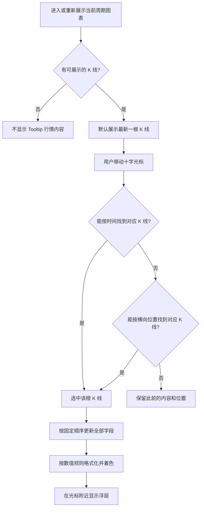

> 历史归档：保留 2026-09-06 的旧实现业务记录；归档于 2026-09-12。本文不是现行 UI 或标准数据契约，不能据此恢复旧昨收回退、总股本回退、缺失补零或 hover 缺陷。现行规则见 [Tooltip 说明](../kline-tooltip.md)、[显示规范](../2026-09-06-kline-display-and-indicators-spec.md) 和 [统一契约](../2026-09-12-market-data-contract.md)。

# 股票详情页 K 线 Tooltip 展示业务逻辑

本文用于 Tooltip 的业务迁移，根据当前行为整理展示内容、字段计算、取值规则、交互流程和异常边界。范围包括生成 Tooltip 展示值所需的业务公式及其数据来源，不包括 MA、MACD 等技术指标计算、图表绘制、右侧快照或数据请求流程。

接口字段名仅用于识别数据含义，不限定新系统的接口地址、入参或实现方式。核对日期：2026-09-06。下文区分正常展示规则与当前存在的边界问题，避免把现有问题误当作必须保留的业务要求。

## 1. 业务用途与展示前提

Tooltip 用于查看某一根 K 线对应周期的行情明细。浮层中的所有字段必须对应同一根 K 线，不能混用光标所在 K 线与最新 K 线的数据。

- 支持日线，以及 1、5、15、30、60 分钟线；不同周期展示相同的 11 个字段。
- 有可展示的 K 线数据时，首次默认展示当前周期最新一根 K 线。
- 用户在图表上移动十字光标后，展示光标对应 K 线的数据。
- 页面处于加载、加载失败、无行情或 K 线列表为空状态时，不展示有效的 Tooltip 行情内容。
- “最新”指当前数据中时间最晚的一根 K 线，不代表实时 Tick 报价。
- 成交量、成交额和换手率属于该根 K 线对应周期，不额外累加为当日总量。

## 2. 展示字段与顺序

字段顺序固定如下。字段没有可展示值时仍保留该行，按相应规则显示占位，不因缺值改变顺序。

| 顺序 | 展示名称 | 对应数据 | 展示规则 |
| --- | --- | --- | --- |
| 1 | 时间 | `tradeTime` | 日线显示上海日期；分钟线显示上海日期和时分。 |
| 2 | 昨收 | `prevClose` | 大于 0 时显示两位小数；缺失、等于 0 或小于 0 时显示 `--`。 |
| 3 | 开盘 | `open` | 显示该根 K 线开盘价，保留两位小数。 |
| 4 | 收盘 | `close` | 显示该根 K 线收盘价，保留两位小数。 |
| 5 | 最高 | `high` | 显示该根 K 线最高价，保留两位小数。 |
| 6 | 最低 | `low` | 显示该根 K 线最低价，保留两位小数。 |
| 7 | 涨跌额 | `changeAmount` | 优先显示数据服务提供的值，缺失时按第 3 节补算；保留两位小数，正数加 `+`。 |
| 8 | 涨跌幅 | `changeRate` | 优先显示数据服务提供的值，缺失时按第 3 节补算；转成百分数并保留两位小数，正数加 `+`。 |
| 9 | 成交量 | `volume` | 按“手”理解原始数量，除以 10,000 后保留两位小数，固定追加“万手”。 |
| 10 | 成交额 | `amount` | 按人民币元理解原始金额，除以 100,000,000 后保留两位小数，固定追加“亿”。 |
| 11 | 换手率 | `turnoverRate` | 业务公式及股本口径见第 3 节；返回比例转成百分数并保留两位小数，不加正号。当前缺失时显示 `--`，不由 Tooltip 补算。 |

### 时间规则

- 全部按上海时区展示，不随用户所在地区或浏览器时区改变。
- 日线示例：`2026-09-04`。
- 分钟线示例：`2026-09-04 09:45`，不显示秒；五种分钟周期规则相同。
- 数据带时区时，先转换为上海时间再取日期和时分；不能直接截取原日期。例如 UTC 的 `2026-03-02 16:00` 应显示上海日期 `2026-03-03`。
- 原始时间没有时区时，当前按上海时间理解。
- 时间无法识别时，当前浮层保留原始时间文本，不自行猜测日期。这不代表异常时间对应的 K 线一定能正常展示。

### 数字与单位规则

- 两位小数采用四舍五入展示；价格、涨跌额不额外追加“元”，也不使用千位分隔符。
- 涨跌幅和换手率的数据是小数比例：`0.05` 表示 `5.00%`，不是 `0.05%`。
- 涨跌额、涨跌幅为零时分别显示 `0.00`、`0.00%`，不加正号。换手率为零显示 `0.00%`。
- 成交量、成交额固定使用“万手”和“亿”，不会因数量较小而改用“手”或“元”；零值分别显示 `0.00万手`、`0.00亿`。
- 符号和颜色按四舍五入前的值判断。因此极小的正涨跌额可能显示为红色 `+0.00`，极小的负涨跌额可能显示为绿色 `-0.00`，不能仅凭显示后的零判断平盘。

## 3. 字段来源、业务计算与取值优先级

业务迁移需要保留展示值的计算口径，无论该值原来由数据服务还是 Tooltip 计算。以下分别说明“怎么算”和“当前展示时是否补算”；已有结果不因更换页面而重复计算。

### 数据服务提供什么

时间、开盘、收盘、最高、最低、成交量和成交额来自该根 K 线的行情数据。当前上游是 QMT；Tooltip 负责选取对应 K 线和格式化展示，不重新生成行情价格。

“昨收”、涨跌额、涨跌幅和换手率可能已经由数据服务处理或计算，不应把它们全部理解为上游直接返回的原始字段：

| 数据 | 当前来源口径 | Tooltip 的职责 |
| --- | --- | --- |
| 昨收 | 数据服务依次优先采用原始昨收、结算价、上一根 K 线收盘价；仅采用大于 0 的基准。 | 使用最终返回的昨收，不自行查找其他 K 线替换。 |
| 涨跌额、涨跌幅 | 数据服务依据最终昨收和当前收盘价计算。 | 优先展示服务结果，仅在对应结果缺失时补算。 |
| 换手率 | 数据服务将成交量从“手”换算为“股”后除以股本；优先流通股本，不可用时回退总股本；均不可用时为空。 | 只把返回比例格式化成百分数，缺失时显示 `--`。 |

“昨收”是现有展示名称。分钟周期的数据若采用上一根收盘价作为回退基准，该值可能来自同日上一根 K 线，不一定是上个交易日的收盘价。业务迁移应保持返回基准的含义，不根据标签重新计算。

当前“成交量按手理解”是本项目已有业务口径；既有上游资料没有明确标注该字段单位。更换数据来源时需核对数量单位，避免多乘或少乘 100，造成成交量与换手率同时失真。

### 昨收基准的确定

计算涨跌之前，先按以下顺序确定基准，找到第一个大于 0 的价格后停止：

1. 该根 K 线的原始昨收。
2. 该根 K 线的结算价。
3. 按时间排序后，上一根 K 线的收盘价。
4. 都不存在或不大于 0 时，基准不可得，昨收显示 `--`。

“上一根”是当前取得的行情序列中的上一根，不额外跨出该序列查找。第一根如果同时缺少有效原始昨收和结算价，无法采用上一根回退。结算价仅作为基准来源，不增加独立展示行。

### 涨跌额

**业务公式：涨跌额 = 该根 K 线收盘价 - 有效昨收基准。** 单位与价格一致，当前为元。

1. 数据服务已经提供涨跌额时，直接使用，包括明确提供的零值；即使昨收不可用，也仍展示该结果。
2. 数据服务未提供涨跌额，但昨收有效时，用“收盘价减昨收”补算。
3. 数据服务未提供涨跌额，且昨收无效时，显示 `--`。

例如收盘价为 10.50 元、昨收为 10.00 元，涨跌额为 0.50 元，显示 `+0.50`；收盘价为 9.50 元时，显示 `-0.50`。补算还需要有效的收盘价，不能先把价格格式化为两位小数再参与计算。

### 涨跌幅

**业务公式：涨跌幅比例 =（该根 K 线收盘价 - 有效昨收基准）÷ 有效昨收基准。** 展示时将比例乘以 100，保留两位小数后加 `%`。

1. 数据服务已经提供涨跌幅时，直接使用，包括明确提供的零值；即使昨收不可用，也仍展示该结果。
2. 数据服务未提供涨跌幅，但昨收有效时，用“收盘价减昨收，再除以昨收”补算。
3. 数据服务未提供涨跌幅，且昨收无效时，显示 `--`。

例如收盘价为 10.50 元、昨收为 10.00 元，涨跌幅比例为 0.05，显示 `+5.00%`。昨收为零时不可相除，不能计算为零涨幅，也不能用零代替缺失结果。

涨跌额和涨跌幅独立判断是否需要补算。只提供其中一个值时，不用这个值反推另一个值；例如只有服务提供的涨跌额时，缺失的涨跌幅仍按收盘价与昨收计算。Tooltip 当前也不校验服务提供的两个结果是否相互一致。

### 换手率

换手率按“该根 K 线成交股数占基准股本的比例”计算，分子和分母必须统一为“股”。

| 计算输入 | 业务含义与单位 |
| --- | --- |
| 成交量 | 所选 K 线对应周期的成交量，当前数据口径为“手”；不能使用已换算并保留两位小数的“万手”展示值。 |
| 流通股本 | 该股票的流通股数量，单位为“股”，优先用作分母。 |
| 总股本 | 该股票的总股数量，单位为“股”，流通股本不可用时作为回退分母。 |

**股本选择顺序：** 流通股本存在且大于 0 时采用流通股本；否则采用大于 0 的总股本；两者均不可用时不计算换手率。流通股本和总股本不是两者相加，也不能把股本“万股”数值直接当作“股”参与相除。

**计算与展示流程：**

1. 成交股数 = 成交量（手）× 100。
2. 换手率比例 = 成交股数 ÷ 基准股本（股）。
3. 百分数数值 = 换手率比例 × 100。
4. 将百分数数值保留两位小数并加 `%`，不加正号，使用黑色。

这里的两次“乘以 100”含义不同：第一次把手换为股，第二次把小数比例转为百分数。服务返回的是第二步的比例，例如 `0.02`；Tooltip 将它显示为 `2.00%`，不能把已经是百分数数值的 `2` 再显示成 `200.00%`。

例如该根 K 线成交量为 20,000 手、流通股本为 100,000,000 股：成交股数为 2,000,000 股，除以流通股本得到 0.02，最终显示 `2.00%`。若流通股本不可用，改用总股本 200,000,000 股，则比例为 0.01，显示 `1.00%`。

| 情况 | 计算结果与展示 |
| --- | --- |
| 成交量存在，且有有效流通股本 | 使用流通股本计算。 |
| 成交量存在，流通股本缺失、为零或负值，总股本有效 | 使用总股本计算；这是总股本口径，与流通股本口径的结果不同。当前展示标签仍为“换手率”。 |
| 股本资料缺失，或两类股本均不可用 | 不计算，结果为空，显示 `--`。 |
| 成交量缺失 | 不计算，结果为空，显示 `--`。即使成交量展示因接入补零变成 `0.00万手`，也不因此把换手率改为零。 |
| 成交量明确为零，且基准股本有效 | 比例为零，显示 `0.00%`。 |
| 成交量为零，但基准股本不可用 | 仍无法计算，显示 `--`，不能把分母缺失忽略。 |
| 已提供换手率比例 | 当前 Tooltip 直接展示；不因为明细中缺少股本字段而丢弃该结果。 |

当前由数据服务完成上述计算；Tooltip 明细不包含流通股本和总股本，因此当前没有足够输入自行补算缺失换手率。业务迁移应保留完整公式，但不能把“业务公式必须明确”误写成“浮层必须再次计算”。

**历史口径边界：** 当前同一次取得的 K 线序列使用同一份股票股本资料，没有按每根历史 K 线的日期还原当时股本。遇到股本变化时，历史换手率可能与按当时股本计算的结果不同；本次文档不将其描述为已实现历史股本校准。

### 成交量与成交额的展示换算

| 展示值 | 业务公式 | 示例 |
| --- | --- | --- |
| 成交量（万手） | 原始成交量（手）÷ 10,000，保留两位小数后加“万手”。 | 20,000 手显示 `2.00万手`；500 手显示 `0.05万手`。 |
| 成交额（亿） | 原始成交额（元）÷ 100,000,000，保留两位小数后加“亿”。 | 150,000,000 元显示 `1.50亿`；500,000 元显示 `0.01亿`。 |

这两项是单位换算，不重新计算成交量或成交额。尤其不能用“收盘价 × 成交量”代替服务提供的成交额，因为一个周期内的成交可能发生在不同价格。所有业务计算先用原始数值完成，最后才对展示值保留两位小数。

### 缺失与零值的区别

- 昨收、涨跌额、涨跌幅和换手率缺失时，按上面的有效基准、补算或占位规则处理；缺失不等于零。
- 现有数据接入流程会把缺失或无法识别的开盘、收盘、最高、最低、成交量、成交额补为零。因此页面可能展示 `0.00`、`0.00万手` 或 `0.00亿`；这些零不一定代表实际行情为零。
- 若浮层直接收到无效的成交量或成交额，当前显示 `--`。这与上一条“在接入时已被补成零”的情况不同。
- 无效价格和异常比例没有统一、完整的展示保障。正常业务数据应提供有效数值，不能把异常内容显示为正常行情。

## 4. 颜色规则

开盘、收盘、最高、最低分别与有效昨收比较，各自决定颜色；不是整块浮层统一变红或变绿。

| 展示项 | 红色 | 绿色 | 黑色或中性色 |
| --- | --- | --- | --- |
| 开盘、收盘、最高、最低 | 该价格高于昨收 | 该价格低于昨收 | 等于昨收，或没有有效昨收时为黑色。 |
| 涨跌额、涨跌幅 | 最终涨跌额大于 0 | 最终涨跌额小于 0 | 最终涨跌额为零或不可得时为黑色。 |
| 昨收、成交量、成交额、换手率 | 不使用 | 不使用 | 固定黑色。 |
| 时间 | 不使用 | 不使用 | 固定灰色。 |

特别注意：

- 涨跌幅的颜色跟随涨跌额，不独立依据涨跌幅正负决定。
- 服务提供了涨跌幅但涨跌额不可得时，涨跌幅仍显示数值，颜色为黑色。
- 服务提供的涨跌额与涨跌幅方向矛盾时，当前仍显示各自的数值，但两行都按涨跌额着色。
- 价格颜色按昨收比较，与蜡烛形态按开盘、收盘关系显示的颜色不一定一致。

## 5. 显示业务流程

### 首次展示与光标移动

选取 K 线时优先使用时间；日线按上海交易日匹配，分钟线按对应时刻匹配。时间无法匹配时，再依据光标横向位置选择最近的 K 线位置；位置必须落在已有数据范围内。

正常命中后，所有字段一起更新，浮层随光标位置调整。无法匹配任何 K 线时，当前不会自动把浮层切回最新一根，也不会主动改动其位置或显示状态。时间信息异常导致无法完成回退的情况见第 7 节。

### 光标离开与再次进入

| 场景 | 当前显示行为 |
| --- | --- |
| 已经成功悬浮查看过某根 K 线，随后离开图表 | 隐藏浮层；再次进入并匹配到 K 线后重新显示。 |
| 首次默认展示后，从未成功悬浮选中过任何 K 线便离开 | 当前默认最新行情浮层仍可能保持显示。 |
| 离开后重新进入，但无法匹配任何 K 线 | 保留此前的隐藏或显示状态，直到成功匹配。 |

因此，“离开图表时一定隐藏”不能概括当前行为。上表第二种情况是当前边界行为，不应直接当作业务上必须保留的要求。

### 数据更新与周期切换

| 场景 | 当前显示行为 |
| --- | --- |
| 还未悬浮选择，行情列表发生更新 | 默认浮层改为最新一根 K 线。 |
| 正在查看的 K 线在新数据中已不存在 | 显示内容回退到新列表的最新一根；不因此强制显示浮层或移动位置。 |
| 正在查看的 K 线仍存在，但同一时刻数值已变化 | 当前可能保留更新前的数值，直到用户再次移动十字光标。 |
| 切换周期并重新初始化图表交互状态 | 从新周期最新一根开始默认展示。 |
| 切换周期但之前的悬浮状态仍被保留 | 可能沿用旧选择、位置或显示状态；需要核对浮层与新周期行情是否一致。 |
| 页面变为加载、错误或无行情状态 | 不继续展示旧周期的有效 Tooltip 行情内容。 |

业务迁移时，浮层应与当前股票、当前周期和所选 K 线保持一致。同一时刻更新后停留旧值、跨周期保留旧选择属于需明确处理的现有问题，不应理解为允许混用行情数据。

## 6. 位置与展示方式

- 浮层显示在图表内、靠近光标的位置，初始默认位置在左上角附近。
- 优先放在光标右下方；右侧空间不足时改放到左侧。
- 靠近底部时向上限制位置，避免继续向下超出图表；当前没有独立的上下翻转规则。
- 浮层自身不接受点击，也不阻挡用户继续移动光标或操作图表；当前没有点击固定、拖动浮层或关闭按钮。
- 各行采用左侧字段名称、右侧字段值的排列。当前为白底、浅色边框与阴影，显示和隐藏带淡入淡出效果。
- 现有浮层宽度为 210px，正常定位尽量保留距边缘至少 8px 的空间。容器小于 226px 时仍可能横向溢出；初始默认位置也没有经过边界限制。
- 实际字体、长时间文本和较大数值可能影响排版。业务迁移需要保证全部字段可读、浮层尽量完整显示，不能仅以沿用旧宽度作为验收依据。

## 7. 当前边界与业务验收注意事项

以下是当前行为存在的限制，单独列出以避免把“业务规则”与“实现缺口”混在一起：

| 边界 | 对用户的影响 | 业务验收关注点 |
| --- | --- | --- |
| 默认显示后首次离开 | 未曾选中过 K 线时，浮层可能继续显示。 | 明确初始浮层与离开隐藏是否采用相同规则。 |
| 同一根 K 线数值更新 | 停留的浮层可能显示旧值，移动后才更新。 | 区分“保留所选 K 线”和“保留旧行情数值”；保持选择不应意味着行情永不刷新。 |
| 切换周期仍保留先前选择 | 浮层可能没有恢复到新周期默认状态。 | 不显示其他周期的旧行情。 |
| 无法取得光标对应时间 | 当前存在浮层更新异常的情况，不能保证每次都成功回退到横向位置匹配。 | 光标处于空白区域或时间不可用时，页面仍应可继续操作。 |
| 窄容器、长文本或窗口尺寸变化 | 浮层可能溢出、文字拥挤或位置不准确。 | 验证实际显示区域、最长时间与数值，不遮挡或截断关键信息。 |
| 移动端与其他交互方式 | 当前未定义独立的长按查看、点按关闭或键盘选择规则。 | 如目标业务需要这些方式，应另行明确；不能视为现有 Tooltip 已具备。 |

## 8. 展示示例与验收清单

以下为展示用示意数据，不是真实行情：

| 输入含义 | 示例值 | Tooltip 展示 |
| --- | --- | --- |
| 分钟线时间 | 上海时间 2026 年 9 月 4 日 09:45 | `2026-09-04 09:45` |
| 昨收 | 10 | `10.00`，黑色 |
| 开盘 | 10.2 | `10.20`，红色 |
| 收盘 | 10.5 | `10.50`，红色 |
| 最高 | 10.6 | `10.60`，红色 |
| 最低 | 9.9 | `9.90`，绿色 |
| 涨跌额未提供，按上述收盘和昨收计算 | 0.5 | `+0.50`，红色 |
| 涨跌幅未提供，按上述收盘和昨收计算 | 0.05 | `+5.00%`，红色 |
| 成交量 | 20,000 手 | `2.00万手`，黑色 |
| 成交额 | 150,000,000 元 | `1.50亿`，黑色 |
| 换手率；流通股本为 100,000,000 股，成交量如上 | 比例为 0.02 | `2.00%`，黑色 |

若同一例子中的换手率未提供，则该行显示 `--`，不影响其他字段展示。

| 场景 | 验收要点 |
| --- | --- |
| 首次进入且有数据 | 默认最新一根，11 行齐全且顺序正确。 |
| 日线与五种分钟线 | 字段相同，时间格式按日线/分钟线区分，并统一为上海时间。 |
| 悬浮历史 K 线 | 全部字段对应所选 K 线，不能夹杂最新行情。 |
| 开高低收分别高于、低于或等于昨收 | 每个价格独立呈现红、绿或黑色。 |
| 涨跌为正、负、零及极小值 | 两位小数、正负号和颜色符合未舍入值的规则。 |
| 昨收缺失、零或负值 | 昨收显示 `--`，价格变黑；服务已提供的涨跌结果仍显示。 |
| 涨跌字段分别缺失或明确为零 | 独立补算，明确零值不被覆盖，无法补算时显示 `--`。 |
| 比例为 0.05、换手率缺失或为零 | 百分数换算正确，缺失与零值清晰区分。 |
| 换手率采用流通股本或回退总股本 | 同为 20,000 手，分母为 100,000,000 股时显示 `2.00%`，回退为 200,000,000 股时显示 `1.00%`。 |
| 成交量缺失，或股本缺失、为零、负值 | 按换手率计算前提判断；无法计算显示 `--`，不因成交量接入补零而显示零换手率。 |
| 历史 K 线跨越股本变化 | 明确当前采用同一份股本资料的口径，不误认已经使用各历史时点股本。 |
| 成交量、成交额较小、为零或无效 | 固定单位，区分真实零、接入补零和无效数值占位。 |
| 离开、重新进入或无法匹配 K 线 | 按第 5 节区分当前行为与待明确的边界，不笼统认定离开必隐藏。 |
| 数据刷新、所选 K 线消失、周期切换 | 验证选中对象和显示数值的归属，关注现有旧值残留问题。 |
| 浮层靠近边缘、窄屏与长数值 | 字段可读，位置合理，浮层不阻挡图表交互。 |

本文依据当前前端代码核对业务规则；当前边界问题未在本次工作中修复，也未进行真实浏览器和移动端展示验收。
